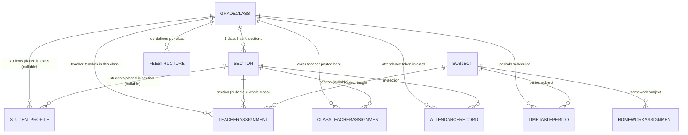
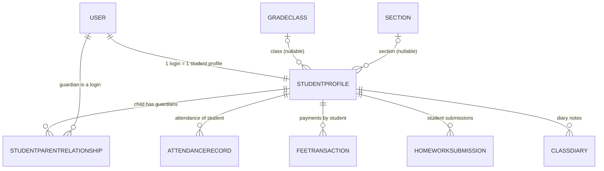
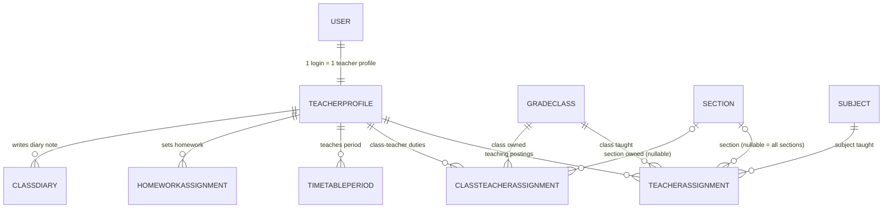
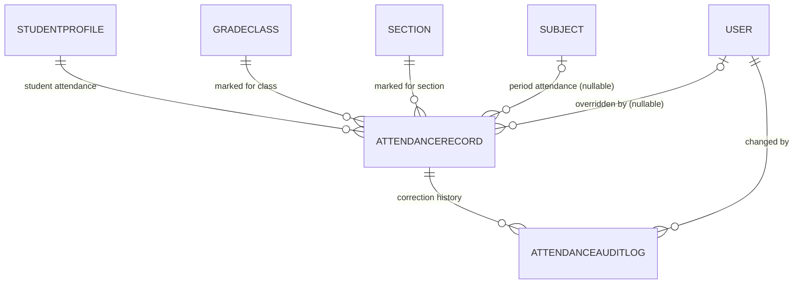
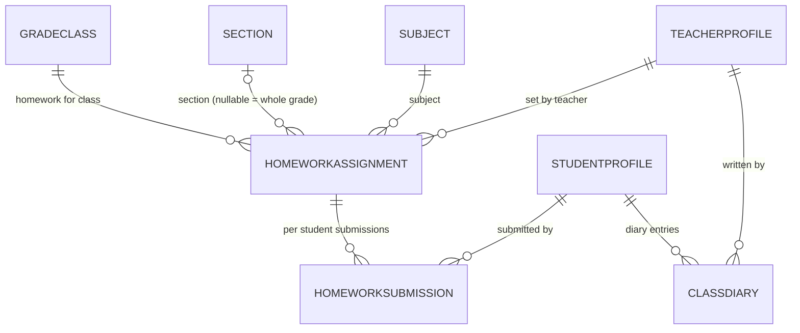
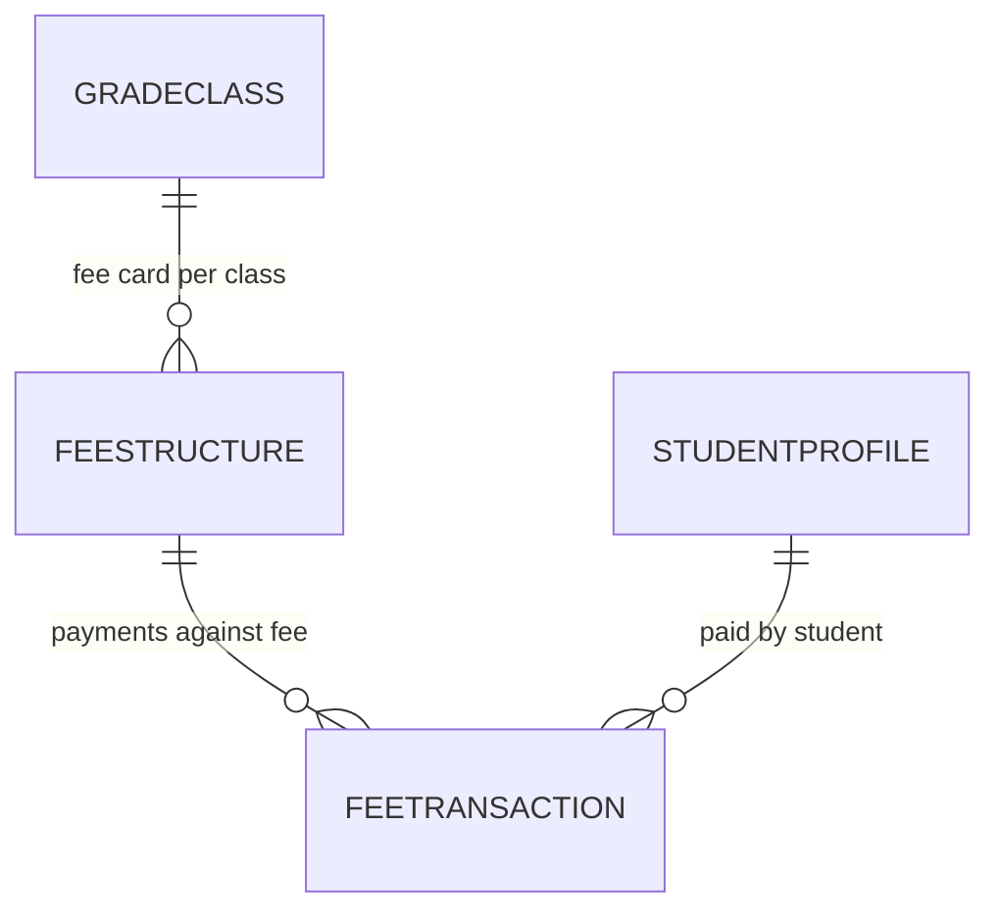
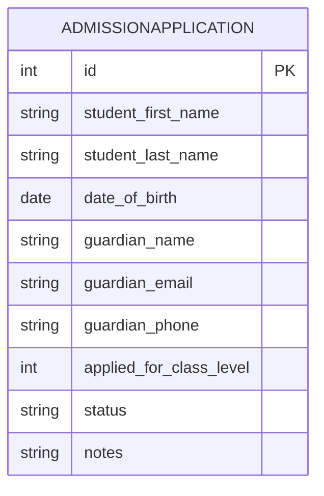
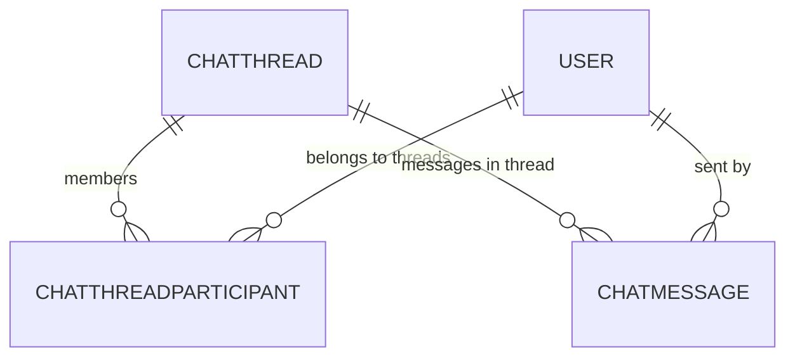
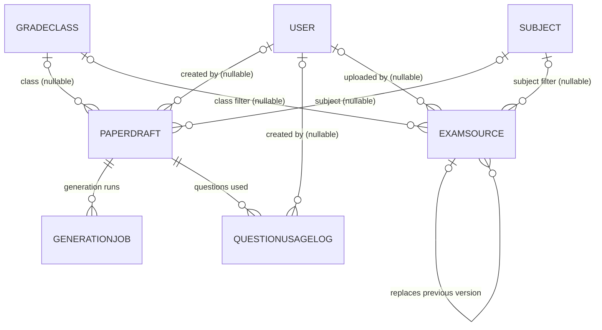

# Educonnect - Database Design (ER Reference)

> **Purpose:** one place that answers "what tables do we have, how are they connected, and WHY are
> they built this way" - understandable without reading any code.
>
> **Source of truth:** the SQLModel classes in `backend/app/domains/<domain>/models.py`.
> Every column, foreign key and constraint below was read from those files (not guessed).
> Row counts and enum lists were read live from the running PostgreSQL container.
>
> **Last verified:** 2026-09-29 against migration head `d3f8b2c7a1e5`.

---

## 0. How to read this document

Every table section starts with a **metadata block**. Here is what each field means:

| Field | Meaning |
|---|---|
| **Currently used** | `YES` = real API endpoints read/write this table right now. `YES (partial)` = table is real, but some screens for it still return demo data. `NO` = the table exists in the DB but no code uses it. |
| **Rows now** | Live row count at the time of writing (a snapshot, not a promise). |
| **Columns connected** | The foreign-key lines that touch this table, written as `my_table.column -> other_table.column`. `<` in an arrow means "someone points at me". |
| **Where used** | The API endpoints (and the code files) that touch this table. |
| **Depend on** | Tables that **depend on me** - i.e. tables that hold a foreign key pointing at my `id`. If I am deleted, they break. (My children.) |
| **Depend to** | Tables that **I depend on** - i.e. foreign keys I hold pointing at other tables. They must exist before I can. (My parents.) |

Two more conventions:

- Table names are lowercase because SQLModel derives the table name from the class name
  (`GradeClass` -> `gradeclass`). Column names are always snake_case.
- `PK` = primary key, `FK` = foreign key, `JSON` = PostgreSQL `JSON` column (flexible blob),
  `ENUM` = native PostgreSQL enum type.

---

## 1. Database at a glance

| Item | Value |
|---|---|
| Engine | PostgreSQL 16 (Docker image `postgres:16-alpine`) |
| Container | `eduverse-db` |
| Database | `educonnect_db` |
| Schema | `public` (all tables live here) |
| Tables in use | **27** (defined as SQLModel `table=True` classes) |
| Tables orphaned | **0** - the 3 legacy orphan tables were **dropped on 2026-09-29** by migration `c9a2e7f1d4b8` (see section 17) |
| Bookkeeping | `alembic_version` (1 row: current migration hash) |
| Schema defined in | `backend/app/domains/*/models.py` |
| Schema changed by | Alembic migrations in `backend/alembic/versions/` (12 files) |
| Current migration head | `d3f8b2c7a1e5` (adds `studentprofile.gender`) |
| Demo data | `backend/scripts/seed.py` (users, one class/section, fees, timetable) + `backend/scripts/seed_academics.py` (5 classes, 10 sections, 81 students, 801 attendance rows). Both run automatically at container start and skip themselves when the data already exists. |
| API prefixes | `/auth /users /academics /students /teachers /attendance /finance /timetable /exams /admissions /chat /dashboard` + root routes from `operations` |

---

## 2. Row-count snapshot (live)

| Table | Rows | Currently used | Comment |
|---|---|---|---|
| `user` | 92 | YES | 81 students + 5 class teachers + admin, principal, hod, accountant, librarian, guardian (demo school). Every person is a `user` row first. |
| `permission` | 137 | YES | Permission catalog (codename + category + label). |
| `rolepermission` | 701 | YES | Role -> permission grants. Powers every `RequirePermission(...)` check. |
| `gradeclass` | 5 | YES | Grades 6-10 (demo school). Real CRUD, and the class views aggregate from here. |
| `section` | 10 | YES | Two sections (A, B) per grade, via `/academics/classes/{id}/sections` + `/class-info`. |
| `subject` | 1 | **NO** | Only `Mathematics` exists; model + schema exist but there is **no endpoint and no query anywhere** (see 7.3). |
| `studentprofile` | 81 | YES | 8 per section plus the original demo student - students list, class matrix, RBAC "own record" scoping. |
| `studentparentrelationship` | 0 | YES | Read by auth/chat to answer "which children may this parent see". |
| `teacherprofile` | 5 | YES | 1 core demo teacher + 4 seeded class teachers. |
| `teacherassignment` | 0 | YES | Read by `auth/service.py` to scope teachers to class+subject (no write path yet - see 20.3). |
| `classteacherassignment` | 10 | YES | One class teacher per section (makes `/class-info` show real names). |
| `attendancerecord` | 801 | YES | 10 weekdays of attendance per demo student; feeds `avgAttendance` and `/attendance/irregular`. |
| `attendanceauditlog` | 0 | YES | Written when an attendance record is overridden. |
| `homeworkassignment` | 1 | YES | Homework list + create. |
| `homeworksubmission` | 1 | YES | Submissions list. |
| `classdiary` | 0 | YES | Diary entries per student. |
| `timetableperiod` | 1 | YES | Timetable by class / by teacher. |
| `feestructure` | 1 | YES | Fee structures per class. |
| `feetransaction` | 1 | YES | Payments per student. |
| `admissionapplication` | 0 | YES | Public apply + admin list + status update. |
| `chatthread` | 6 | YES | Chat threads (1:1 and group); the core seed opens default threads. |
| `chatmessage` | 0 | YES | Messages inside a thread. |
| `chatthreadparticipant` | 48 | YES | Who is in which thread (composite PK). |
| `paperdraft` | 12 | YES | **AI paper builder.** The heart of the exams domain. |
| `generationjob` | 9 | YES | One row per AI generation run (polled by the wizard). |
| `examsource` | 0 | YES | RAG content library (PDF/URL/text) with dedup + versioning. |
| `questionusagelog` | 0 | YES | Anti-repeat ledger: which question was used in which paper. |
| ~~`exampaper`~~ | 0 | **removed** | Legacy term->paper table, dropped by migration `c9a2e7f1d4b8` (see section 17). |
| ~~`examterm`~~ | 0 | **removed** | Dropped by the same migration. |
| ~~`examresult`~~ | 0 | **removed** | Dropped by the same migration. |

`alembic_version` holds 1 row (`d3f8b2c7a1e5`). The `public` schema now contains **28** tables
(27 live + `alembic_version`).

> These counts come from the demo data seeded by `backend/scripts/seed.py` and
> `backend/scripts/seed_academics.py`, which run automatically on container start. Run the
> `COUNT(*)` queries in section 22 to refresh them.

---

## 3. Why the schema is shaped this way (the important part)

Seven decisions explain almost every table in this database.

**3.1 One `user` table for every person - profiles extend it 1:1.**
A student, a teacher, a parent and the principal all log in the same way. So identity
(email, password hash, role, active flag) lives in exactly one place. Anything
person-specific is added by a *profile* table that points back with a **unique** foreign key
(`studentprofile.user_id`, `teacherprofile.user_id` are UNIQUE = 1:1).
*Why:* one login mechanism, one password reset, one session table - and a person could later be
both a teacher and a parent without duplicating identity rows.

**3.2 The school's structure is three small "reference" tables.**
`gradeclass` (the class), `section` (a division of a class) and `subject` are tiny and slow-changing.
Almost every other table points at them instead of storing the text "8-A" or "Science".
*Why:* rename a class once and every timetable, attendance row and fee structure follows.
Storing strings everywhere would mean editing thousands of rows and losing consistency.

**3.3 Many-to-many is a table, not a column.**
A teacher teaches many subjects in many classes; a student can have a mother, a father and a
guardian as three separate logins; a chat thread has many people.
Those facts cannot be a single column, so they get junction tables:
`teacherassignment`, `classteacherassignment`, `studentparentrelationship`, `chatthreadparticipant`.
*Why:* a column can hold one value. Reality here needs a set, and junction rows can carry extra
facts of their own (`relationship_type`, `section_id`, ...).

**3.4 The AI/exam domain uses JSON columns - deliberately.**
`paperdraft` stores the blueprint, the coverage plan, the AI questions (`part_a`) and the teacher's
questions (`part_b`) as JSON. *Why:* the paper format is the most volatile part of the product -
new question types, new blueprint rules, new grading hints appear weekly, and each would otherwise
need a database migration plus a redeploy. JSON lets the AI layer evolve at software speed, while
the *stable* columns (ids, marks total, status, timestamps) stay real columns so they can be queried.

**3.5 Delete protection everywhere (no cascades).**
No foreign key in this schema uses `ON DELETE CASCADE`. *Why:* school data is audit data.
Deleting a class must never silently erase a year of attendance. The database refuses the delete
and forces the application to decide consciously.

**3.6 Status values are native PostgreSQL enums, not free strings.**
`roleenum`, `attendancestatus`, `paperstatus`, ... *Why:* the database rejects a typo like
`"aproved"` at write time. The cost is that adding a value needs a migration - which is why the
fast-moving fields in exams deliberately use plain `str` (`examsource.status = pending|ingesting|ready|failed`).

**3.7 Anti-repeat needs a ledger, not a search.**
`questionusagelog` exists separately from `paperdraft` even though questions live inside
`paperdraft.part_a`. *Why:* "don't repeat a question we asked six months ago" is a **cross-paper**
question. Answering it from JSON would mean loading every paper; a table plus an index on
`fingerprint` answers it in one query.

---

## 4. Master ER map (layers)

```
LAYER 0 - IDENTITY & RBAC
    [user] .......................................... every person (student/teacher/parent/staff)
      |                                                                  [permission] (catalog)
      |                                                                        ^
      |                                                                        | permission_id
      |                                                     [rolepermission] (role -> permission)
      |                                            (role is a TEXT value, not an FK to user)

LAYER 1 - SCHOOL STRUCTURE (reference data)
    [gradeclass] --1:N--> [section]                    [subject]   (standalone lookup)

LAYER 2 - PEOPLE PROFILES (1:1 with user)
    [studentprofile] --> user, gradeclass, section
    [teacherprofile] --> user

LAYER 3 - MAPPING / JUNCTION TABLES
    [studentparentrelationship]  studentprofile <---> user (the parent's login)
    [teacherassignment]          teacherprofile x gradeclass x subject x (section)
    [classteacherassignment]     teacherprofile x gradeclass x (section)

LAYER 4 - DAY-TO-DAY RECORDS
    [attendancerecord] --> studentprofile, gradeclass, section, (subject), (user = who overrode)
        [attendanceauditlog] --> attendancerecord, user
    [homeworkassignment] --> gradeclass, (section), subject, teacherprofile
        [homeworksubmission] --> homeworkassignment, studentprofile
    [classdiary] --> studentprofile, teacherprofile
    [timetableperiod] --> gradeclass, (section), subject, teacherprofile
    [feestructure] --> gradeclass
        [feetransaction] --> studentprofile, feestructure
    [chatthread] <--> [chatthreadparticipant] <--> user
        [chatmessage] --> chatthread, user

LAYER 5 - EXAMS / AI PAPER BUILDER
    [paperdraft] --> (gradeclass), (subject), (user = creator)
    [generationjob] --> (paperdraft)
    [examsource] --> (gradeclass), (subject), (user), (examsource = previous version)
    [questionusagelog] --> (paperdraft), (user)

STANDALONE
    [admissionapplication]  (no foreign keys at all - the applicant is not a student yet)

REMOVED (on 2026-09-29 by migration c9a2e7f1d4b8 - the legacy
term/paper/result tables no longer exist in the database; see section 17)
```

`( ... )` marks a **nullable** foreign key: it may be empty, and the application must handle that.

---

## 5. Complete foreign-key edge list

Every FK in the schema in one list. Read as: *child.column -> parent.column (cardinality)*.

```
section.grade_class_id              -> gradeclass.id         (N-1, required)
studentprofile.user_id              -> user.id               (1-1, required, UNIQUE)
studentprofile.grade_class_id       -> gradeclass.id         (N-1, nullable)
studentprofile.section_id           -> section.id            (N-1, nullable)
studentparentrelationship.student_id      -> studentprofile.id (N-1, required)
studentparentrelationship.parent_user_id  -> user.id           (N-1, required)
teacherprofile.user_id              -> user.id               (1-1, required, UNIQUE)
teacherassignment.teacher_id        -> teacherprofile.id     (N-1, required)
teacherassignment.grade_class_id    -> gradeclass.id         (N-1, required)
teacherassignment.section_id        -> section.id            (N-1, nullable)
teacherassignment.subject_id        -> subject.id            (N-1, required)
classteacherassignment.teacher_id     -> teacherprofile.id   (N-1, required)
classteacherassignment.grade_class_id -> gradeclass.id       (N-1, required)
classteacherassignment.section_id     -> section.id          (N-1, nullable)
attendancerecord.student_id         -> studentprofile.id     (N-1, required)
attendancerecord.grade_class_id     -> gradeclass.id         (N-1, required)
attendancerecord.section_id         -> section.id            (N-1, required)
attendancerecord.subject_id         -> subject.id            (N-1, nullable)
attendancerecord.overridden_by_id   -> user.id               (N-1, nullable)
attendanceauditlog.attendance_record_id -> attendancerecord.id (N-1, required)
attendanceauditlog.changed_by_id    -> user.id               (N-1, required)
homeworkassignment.grade_class_id   -> gradeclass.id         (N-1, required)
homeworkassignment.section_id       -> section.id            (N-1, nullable)
homeworkassignment.subject_id       -> subject.id            (N-1, required)
homeworkassignment.teacher_id       -> teacherprofile.id     (N-1, required)
homeworksubmission.homework_id      -> homeworkassignment.id (N-1, required)
homeworksubmission.student_id       -> studentprofile.id     (N-1, required)
classdiary.student_id               -> studentprofile.id     (N-1, required)
classdiary.teacher_id               -> teacherprofile.id     (N-1, required)
```

```
timetableperiod.grade_class_id      -> gradeclass.id         (N-1, required)
timetableperiod.section_id          -> section.id            (N-1, nullable)
timetableperiod.subject_id          -> subject.id            (N-1, required)
timetableperiod.teacher_id          -> teacherprofile.id     (N-1, required)
feestructure.grade_class_id         -> gradeclass.id         (N-1, required)
feetransaction.student_id           -> studentprofile.id     (N-1, required)
feetransaction.fee_structure_id     -> feestructure.id       (N-1, required)
chatthreadparticipant.thread_id     -> chatthread.id         (N-1, required, part of PK)
chatthreadparticipant.user_id       -> user.id               (N-1, required, part of PK)
chatmessage.thread_id               -> chatthread.id         (N-1, required)
chatmessage.sender_id               -> user.id               (N-1, required)
paperdraft.grade_class_id           -> gradeclass.id         (N-1, nullable)
paperdraft.subject_id               -> subject.id            (N-1, nullable)
paperdraft.created_by               -> user.id               (N-1, nullable)
generationjob.paper_id              -> paperdraft.id         (N-1, nullable)
examsource.grade_class_id           -> gradeclass.id         (N-1, nullable)
examsource.subject_id               -> subject.id            (N-1, nullable)
examsource.created_by               -> user.id               (N-1, nullable)
examsource.replaces_id              -> examsource.id         (self-reference, nullable)
questionusagelog.paper_id           -> paperdraft.id         (N-1, nullable)
questionusagelog.created_by         -> user.id               (N-1, nullable)
```

### Reverse view - the four "hub" tables

Everything points at these; they are the rows you must never delete casually.

| Hub | Referenced by (count) |
|---|---|
| `user` | studentprofile, teacherprofile, studentparentrelationship, attendancerecord, attendanceauditlog, chatthreadparticipant, chatmessage, paperdraft, examsource, questionusagelog (10) |
| `gradeclass` | section, studentprofile, teacherassignment, classteacherassignment, attendancerecord, homeworkassignment, timetableperiod, feestructure, paperdraft, examsource (10) |
| `studentprofile` | studentparentrelationship, attendancerecord, homeworksubmission, classdiary, feetransaction (5) |
| `section` | studentprofile, teacherassignment, classteacherassignment, attendancerecord, homeworkassignment, timetableperiod (6) |

---

## 6. Domain: Identity & RBAC

Files: `backend/app/domains/users/models.py`, `backend/app/domains/auth/models.py`.
Endpoints: `/auth/*`, `/users/*`.

### 6.1 `user` - model: `User`

| Metadata | Value |
|---|---|
| **Currently used** | YES |
| **Rows now** | 92 |
| **Columns connected** | nothing points *at* me from outside, but 10 tables point `*.user_id / *.created_by / *.sender_id / *.changed_by_id / *.overridden_by_id -> user.id` |
| **Where used** | `POST /auth/login`, `POST /auth/token`, `GET /auth/me`, `POST /auth/logout`, `GET /auth/permissions`; `GET /users/me`, `GET /users`, `POST /users`, `PATCH /users/{user_id}/role`; code: `users/repository.py`, `auth/repository.py`, `auth/service.py`, `chat/service.py`, `core/bootstrap.py` |
| **Depend on** (children) | `studentprofile`, `teacherprofile`, `studentparentrelationship`, `attendancerecord`, `attendanceauditlog`, `chatthreadparticipant`, `chatmessage`, `paperdraft`, `examsource`, `questionusagelog` |
| **Depend to** (parents) | none - this is the root of the whole schema |

**Columns**

| Column | Type | Constraints | Purpose |
|---|---|---|---|
| `id` | int | PK | Identity of the person. |
| `email` | str | UNIQUE, indexed | Login name. Unique because it identifies the account. |
| `full_name` | str | - | Display name shown across the UI. |
| `role` | enum | `roleenum` | What this person may do. Drives the RBAC permission lookup. |
| `is_active` | bool | default `true` | Soft disable: a resigned teacher is deactivated, not deleted (audit history stays intact). |
| `hashed_password` | str | - | bcrypt hash. Deliberately *not* part of `UserBase`, so it can never leak through a read schema. |

**Why this design**

- One table for every human, because login must behave identically for students, teachers, parents
  and staff. `role` is the only thing that changes.
- `hashed_password` sits on the table class rather than the shared `UserBase` base class
  (`users/models.py:29-31`). *Why:* every read schema built from `UserBase` is then structurally
  incapable of serialising a password hash - a security guarantee enforced by the type system, not
  by remembering to exclude a field.

> **DB vs code drift (documented, not fixed):** the PostgreSQL `roleenum` type in the live database
> holds **14** labels - `director, principal, hod, teacher, student, parent, accountant, admin,
> class_teacher, subject_teacher, guardian, librarian, transport, staff` - while `RoleEnum` in
> `users/models.py` defines **13** (it has `guardian` but **no `parent`**). The extra `parent` label
> is a leftover from an earlier model. Writing `role="parent"` through the API is impossible today
> because the Python enum rejects it first.

**Relationships**

- `user` 1:1 `studentprofile` - a student's academic record. Exists only for users whose role is `student`.
- `user` 1:1 `teacherprofile` - a teacher's employment record.
- `user` 1:N `studentparentrelationship` (as `parent_user_id`) - one parent login can be linked to several children.
- `user` 1:N `attendancerecord` (as `overridden_by_id`) - records who manually corrected an attendance status.
- `user` 1:N `attendanceauditlog` (as `changed_by_id`) - who made a correction.
- `user` 1:N `chatthreadparticipant`, `user` 1:N `chatmessage` (as `sender_id`).
- `user` 1:N `paperdraft`, `examsource`, `questionusagelog` (as `created_by`).

Also see: every `RequirePermission("...")` dependency in the code resolves a request to a `user` row
and then to permissions through `rolepermission`.

### 6.2 `permission` - model: `Permission`

| Metadata | Value |
|---|---|
| **Currently used** | YES |
| **Rows now** | 137 |
| **Columns connected** | `rolepermission.permission_id -> permission.id` |
| **Where used** | `GET /auth/permissions` (the full catalog), `GET /auth/permissions/roles`, `PUT /auth/permissions/roles/{role}`; code: `auth/permissions_repository.py`, `auth/service.py`, `core/bootstrap.py` (seeds the catalog) |
| **Depend on** (children) | `rolepermission` |
| **Depend to** (parents) | none |

**Columns**

| Column | Type | Constraints | Purpose |
|---|---|---|---|
| `id` | int | PK | - |
| `codename` | str | UNIQUE, indexed | The machine key checked in code, e.g. `students.read`, `classes.read`. |
| `category` | str | default `General` | Grouping for the permissions screen, e.g. `Students`. |
| `label` | str | default `""` | Human sentence shown in the UI, e.g. `Read Students`. |

**Why this design**

- The catalog is **data, not code**. `RequirePermission("classes.read")` in a router needs a row
  here to describe it; admins can therefore see and reason about permissions without reading Python.
- Seeds live in `core/bootstrap.py`, so a fresh database is usable immediately.
- No foreign key from `permission` to anything: a permission is a definition, not a relationship.

### 6.3 `rolepermission` - model: `RolePermission`

| Metadata | Value |
|---|---|
| **Currently used** | YES |
| **Rows now** | 701 |
| **Columns connected** | `rolepermission.permission_id -> permission.id` |
| **Where used** | `GET /auth/permissions/roles`, `PUT /auth/permissions/roles/{role}` (edit a role's grants at runtime); read on every authenticated request; code: `auth/permissions_repository.py`, `core/bootstrap.py` |
| **Depend on** (children) | none |
| **Depend to** (parents) | `permission` |

**Columns**

| Column | Type | Constraints | Purpose |
|---|---|---|---|
| `id` | int | PK | - |
| `role` | str | indexed | A value of the role enum (`admin`, `teacher`, ...), stored as **text, not an FK**. |
| `permission_id` | int | FK -> `permission.id`, indexed | The granted permission. |

**Why this design**

- Splitting catalog (`permission`) from grants (`rolepermission`) is what makes roles editable at
  runtime: 137 definitions stay stable while 701 grants can change per school without a migration.
- `role` is plain text instead of a foreign key to a `roles` table, deliberately. *Why:* the set of
  roles is fixed and lives in the `RoleEnum` in code - a `roles` table would contain 13 rows that
  never change, and the enum already documents them. The trade-off is that the database cannot
  reject an unknown role string; the API layer does that.
- One row per grant (not a JSON list on the role) so a single permission can be audited and
  revoked with one `DELETE`/`INSERT`, and so `role == 'teacher'` is an indexed lookup.

---

## 7. Domain: Academics (school structure)

Files: `backend/app/domains/academics/models.py`.
Endpoints: `/academics/*`. This is the **reference data** layer - the most-referenced tables in the DB.

### 7.1 `gradeclass` - model: `GradeClass`

| Metadata | Value |
|---|---|
| **Currently used** | YES - `/academics/class-matrix` and `/class-info` now aggregate from `gradeclass`, `section`, `studentprofile` and `attendancerecord` (the previous hardcoded rows were removed on 2026-09-29) |
| **Rows now** | 5 |
| **Columns connected** | `section.grade_class_id -> gradeclass.id`, `studentprofile.grade_class_id -> gradeclass.id`, `teacherassignment.grade_class_id -> gradeclass.id`, `classteacherassignment.grade_class_id -> gradeclass.id`, `attendancerecord.grade_class_id -> gradeclass.id`, `homeworkassignment.grade_class_id -> gradeclass.id`, `timetableperiod.grade_class_id -> gradeclass.id`, `feestructure.grade_class_id -> gradeclass.id`, `paperdraft.grade_class_id -> gradeclass.id` (nullable), `examsource.grade_class_id -> gradeclass.id` (nullable) |
| **Where used** | `GET /academics/classes`, `POST /academics/classes`, `GET /academics/class-info`, `GET /academics/class-matrix`; code: `academics/repository.py`, `academics/service.py` (aggregation), `attendance/service.py`, `students/service.py` |
| **Depend on** (children) | `section`, `studentprofile`, `teacherassignment`, `classteacherassignment`, `attendancerecord`, `homeworkassignment`, `timetableperiod`, `feestructure`, `paperdraft`, `examsource` |
| **Depend to** (parents) | none - top of the school-structure hierarchy |

**Columns**

| Column | Type | Constraints | Purpose |
|---|---|---|---|
| `id` | int | PK | - |
| `name` | str | UNIQUE, indexed | Display name, e.g. `Grade 8`. Unique so the same class cannot exist twice. |
| `level` | int | - | Sortable numeric grade, e.g. `8`. Exists so the UI can order classes numerically instead of alphabetically. |
| `sections` | relationship | - | SQLModel convenience: `gradeclass.sections` gives the child list without writing a query. |

**Why this design**

- The class is an entity with an identity, not text. Every attendance row, fee structure and
  timetable period points here, so one rename propagates everywhere.
- `name` (display) and `level` (sort key) are separate on purpose: schools write "Grade 8",
  "Class VIII" or "8" but always sort by 8.

### 7.2 `section` - model: `Section`

| Metadata | Value |
|---|---|
| **Currently used** | YES |
| **Rows now** | 10 |
| **Columns connected** | `section.grade_class_id -> gradeclass.id` (required); `studentprofile.section_id -> section.id` (nullable), `teacherassignment.section_id`, `classteacherassignment.section_id`, `attendancerecord.section_id` (required), `homeworkassignment.section_id`, `timetableperiod.section_id` |
| **Where used** | `GET /academics/classes/{class_id}/sections`, `POST /academics/classes/{class_id}/sections`, `GET /academics/class-info`; code: `academics/repository.py`, `academics/service.py`, `attendance/service.py`, `students/service.py` |
| **Depend on** (children) | `studentprofile`, `teacherassignment`, `classteacherassignment`, `attendancerecord`, `homeworkassignment`, `timetableperiod` |
| **Depend to** (parents) | `gradeclass` |

**Columns**

| Column | Type | Constraints | Purpose |
|---|---|---|---|
| `id` | int | PK | - |
| `name` | str | - | The division letter/name, e.g. `A`. |
| `grade_class_id` | int | FK -> `gradeclass.id`, required | Which class this section belongs to. |
| `grade_class` | relationship | - | Convenience access to the parent row. |

**Why this design**

- Section is a separate table (not a text column on the student) because it is a real thing with
  its own identity: a class teacher is assigned *to a section*, a timetable is built *per section*,
  and attendance is taken *per section*.
- **Known gap:** there is no `UNIQUE (grade_class_id, name)` constraint, so the database would allow
  two sections named `A` inside `Grade 8`. Today that is prevented only by application logic
  (see section 20.4).
- Attention: `section` is required on `attendancerecord` but **nullable** on `studentprofile`,
  `teacherassignment` and `timetableperiod`. Meaning: attendance must always name the section it was
  taken in, while a timetable row or a teacher assignment may be for the whole class.

### 7.3 `subject` - model: `Subject`

| Metadata | Value |
|---|---|
| **Currently used** | **NO** - the model and its schemas exist, but **no endpoint and no query anywhere in the codebase reads or writes this table** (verified: no `select(Subject)` and no `/subjects` route) |
| **Rows now** | 1 |
| **Columns connected** | `teacherassignment.subject_id -> subject.id`, `attendancerecord.subject_id` (nullable), `homeworkassignment.subject_id`, `timetableperiod.subject_id`, `paperdraft.subject_id` (nullable), `examsource.subject_id` (nullable) |
| **Where used** | nothing yet. Only declared in `academics/models.py` and `academics/schemas.py` (`SubjectCreate`, `SubjectRead`) |
| **Depend on** (children) | `teacherassignment`, `attendancerecord`, `homeworkassignment`, `timetableperiod`, `paperdraft`, `examsource` |
| **Depend to** (parents) | none |

**Columns**

| Column | Type | Constraints | Purpose |
|---|---|---|---|
| `id` | int | PK | - |
| `name` | str | UNIQUE, indexed | e.g. `Science`. |
| `code` | str | UNIQUE, indexed | Short machine key, e.g. `SCI`. Both are unique because a subject must be unambiguous in reports. |

**Why this design**

- `subject` is a lookup table for exactly the same reason as `gradeclass`: six different tables store
  `subject_id`, and none of them should store the text "Science".
- It is intentionally **flat**: no link to `gradeclass`, because a subject is school-wide (Science is
  taught in every grade). The class-subject combination is expressed by `teacherassignment`, not by
  the subject row. Creating `subject.grade_class_id` would duplicate a subject per grade and break
  cross-grade reports.

> **Consequence worth knowing:** because there is no read endpoint, the `subject` rows must be
> inserted by seed/migration today, and every feature that displays a subject name
> (timetable, homework, attendance) depends on those rows existing. Adding
> `GET/POST /academics/subjects` is the natural next step (see section 20.2).

**Academics - relationship diagram**



---

## 8. Domain: Students

Files: `backend/app/domains/students/models.py`. Endpoints: `/students/*`, plus the parent-linking
routes in `/users/*`.

### 8.1 `studentprofile` - model: `StudentProfile`

| Metadata | Value |
|---|---|
| **Currently used** | YES |
| **Rows now** | 81 |
| **Columns connected** | `studentprofile.user_id -> user.id` (1-1, UNIQUE), `studentprofile.grade_class_id -> gradeclass.id` (nullable), `studentprofile.section_id -> section.id` (nullable); reverse: `studentparentrelationship.student_id -> studentprofile.id`, `attendancerecord.student_id`, `homeworksubmission.student_id`, `classdiary.student_id`, `feetransaction.student_id` |
| **Where used** | `GET /students`, `POST /students`, `GET /students/{student_id}`; scoping in `auth/service.py`, `chat/service.py`, `finance/router.py`; code: `students/repository.py`, `students/service.py` |
| **Depend on** (children) | `studentparentrelationship`, `attendancerecord`, `homeworksubmission`, `classdiary`, `feetransaction` |
| **Depend to** (parents) | `user`, `gradeclass`, `section` |

**Columns**

| Column | Type | Constraints | Purpose |
|---|---|---|---|
| `id` | int | PK | - |
| `user_id` | int | FK -> `user.id`, **UNIQUE** | The login behind this student. Unique = one profile per account (1:1). |
| `admission_number` | str | UNIQUE, indexed | The school's own student number. Used in reports and on paper records. |
| `date_of_birth` | date | - | Age-based rules, birthdays, and identity fallback. |
| `guardian_name` | str | - | Plain-text guardian name for prints/forms where a login may not exist yet. |
| `gender` | str | nullable | `Male` / `Female` (free text, added by migration `d3f8b2c7a1e5`). Drives the boys/girls split in the class matrix; a student with no gender counts towards strength only. |
| `grade_class_id` | int | FK -> `gradeclass.id`, **nullable** | Current class. |
| `section_id` | int | FK -> `section.id`, **nullable** | Current section. |

**Why this design**

- **Profile split from identity:** `user` answers "can you log in"; `studentprofile` answers "which
  student are you". A guardian account has no student profile; a student account has no teacher
  profile. The unique FKs make that 1:1 relationship a database guarantee, not a convention.
- **Nullable class/section:** a student can exist before being placed (admission in progress,
  transfer in, temporarily unassigned). Code must therefore treat "no class" as a real state.
- **`admission_number` is a second identity, on purpose:** the login identity (`user_id`) is for the
  software; the admission number is what the school already uses on registers and receipts.
- **Both `grade_class_id` and `section_id` are stored** even though the section already implies the
  class. *Why:* class-wide features - attendance sheets, fee structures, class matrices - are the
  most frequent queries in the app and they filter on the class directly, avoiding a join through
  `section` every time. **Trade-off to remember:** the database does not verify that the section
  really belongs to that class, so the application must keep the pair consistent.
- **`gender` was added late, and on purpose.** The class matrix needed a boys/girls
  split that had never been stored (the old endpoint simply made the numbers up). The column is
  nullable, so historical rows stay valid and simply count as "unknown".

### 8.2 `studentparentrelationship` - model: `StudentParentRelationship`

| Metadata | Value |
|---|---|
| **Currently used** | YES |
| **Rows now** | 0 |
| **Columns connected** | `studentparentrelationship.student_id -> studentprofile.id`, `studentparentrelationship.parent_user_id -> user.id` |
| **Where used** | `POST /users/{parent_user_id}/assign-student/{student_id}` (create the link); checked in `auth/service.py` ("may this parent see this student?"), `chat/service.py` (a parent's chat contacts); code: `users/router.py`, `auth/service.py`, `chat/service.py` |
| **Depend on** (children) | none |
| **Depend to** (parents) | `studentprofile`, `user` |

**Columns**

| Column | Type | Constraints | Purpose |
|---|---|---|---|
| `id` | int | PK | - |
| `student_id` | int | FK -> `studentprofile.id`, required | The child. |
| `parent_user_id` | int | FK -> `user.id`, required | The guardian's login account. |
| `relationship_type` | str | default `Parent` | Free text: `Mother`, `Father`, `Guardian`, ... |

**Why this design**

- It is a junction table because the reality is many-to-many in both directions: one student can have
  several guardians, and one parent account can cover several children (siblings).
- The parent is a `user`, not just a name, because parents log in, receive notifications and chat.
  `studentprofile.guardian_name` is the printable fallback for when no account exists yet.
- `relationship_type` is a plain string rather than an enum: schools use local words
  ("Caretaker", "Uncle", "Wali") and the value is displayed, not used in logic.
- This table is the **security boundary for parent access**: a parent sees a student's attendance,
  fees and homework only if a row here links them.

**Students - relationship diagram**



---

## 9. Domain: Teachers

Files: `backend/app/domains/teachers/models.py`. Endpoints: `/teachers/*`, plus class-teacher
assignment in `/users/*`.

### 9.1 `teacherprofile` - model: `TeacherProfile`

| Metadata | Value |
|---|---|
| **Currently used** | YES |
| **Rows now** | 5 |
| **Columns connected** | `teacherprofile.user_id -> user.id` (1-1, UNIQUE); reverse: `teacherassignment.teacher_id -> teacherprofile.id`, `classteacherassignment.teacher_id`, `homeworkassignment.teacher_id`, `classdiary.teacher_id`, `timetableperiod.teacher_id` |
| **Where used** | `GET /teachers`, `POST /teachers`, `GET /teachers/{teacher_id}`, `GET /teachers/workload`, `GET /teachers/performance`; RBAC scoping in `auth/service.py`, `chat/service.py`, `finance/router.py`; code: `teachers/repository.py`, `teachers/service.py` |
| **Depend on** (children) | `teacherassignment`, `classteacherassignment`, `homeworkassignment`, `classdiary`, `timetableperiod` |
| **Depend to** (parents) | `user` |

**Columns**

| Column | Type | Constraints | Purpose |
|---|---|---|---|
| `id` | int | PK | - |
| `user_id` | int | FK -> `user.id`, **UNIQUE** | The login behind this teacher (1:1). |
| `department` | str | - | Which department the teacher belongs to (Science, Languages, ...). |
| `qualification` | str | - | Academic qualification, shown on staff screens. |
| `joining_date` | date | - | Date of joining: service length, payroll, appraisal periods. |

**Why this design**

- Same profile pattern as students, for the same reason: identity is shared, employment facts are not.
  A teacher who is also a parent needs exactly one `user` row and two different profile rows.
- `department` is stored as text here (not a `department` table) because nothing else in the schema
  groups by department yet. If department-level reporting appears, this becomes a lookup table.

### 9.2 `teacherassignment` - model: `TeacherAssignment`

| Metadata | Value |
|---|---|
| **Currently used** | YES (read-only in production: the table is queried for permission scoping; no API route creates rows yet) |
| **Rows now** | 0 |
| **Columns connected** | `teacherassignment.teacher_id -> teacherprofile.id`, `teacherassignment.grade_class_id -> gradeclass.id`, `teacherassignment.section_id -> section.id` (nullable), `teacherassignment.subject_id -> subject.id` |
| **Where used** | queried in `auth/service.py` (a subject teacher may only act on the class+subject they were assigned); referenced in `chat/service.py` for contact lists |
| **Depend on** (children) | none |
| **Depend to** (parents) | `teacherprofile`, `gradeclass`, `section`, `subject` |

**Columns**

| Column | Type | Constraints | Purpose |
|---|---|---|---|
| `id` | int | PK | - |
| `teacher_id` | int | FK -> `teacherprofile.id`, required | The teacher. |
| `grade_class_id` | int | FK -> `gradeclass.id`, required | The class taught. |
| `section_id` | int | FK -> `section.id`, **nullable** | The section taught. `NULL` means "all sections of this class". |
| `subject_id` | int | FK -> `subject.id`, required | The subject taught. |

**Why this design**

- This is the table that answers "what is this teacher allowed to touch?" - it is the backbone of the
  `subject_teacher` role. One row = one teaching posting (teacher + class + subject).
- `section_id` is nullable so a language teacher who takes the whole grade registers **one** row
  instead of one per section. That is also why the RBAC check in `auth/service.py` accepts both
  "assignment for my section" and "assignment for my class without a section".
- **Known gap:** there is no unique constraint on the combination, and no POST endpoint that creates
  assignments yet - so today the rows must be seeded/inserted directly. Until then, permission
  scoping for subject teachers simply matches nothing.

### 9.3 `classteacherassignment` - model: `ClassTeacherAssignment`

| Metadata | Value |
|---|---|
| **Currently used** | YES (both read and write paths exist) |
| **Rows now** | 10 |
| **Columns connected** | `classteacherassignment.teacher_id -> teacherprofile.id`, `classteacherassignment.grade_class_id -> gradeclass.id`, `classteacherassignment.section_id -> section.id` (nullable) |
| **Where used** | `POST /users/teachers/{teacher_id}/assign-class/{class_id}` (creates the row); read in `auth/service.py` to give the `class_teacher` role scope over its own section, and in `users/router.py` |
| **Depend on** (children) | none |
| **Depend to** (parents) | `teacherprofile`, `gradeclass`, `section` |

**Columns**

| Column | Type | Constraints | Purpose |
|---|---|---|---|
| `id` | int | PK | - |
| `teacher_id` | int | FK -> `teacherprofile.id`, required | The teacher who is the class teacher. |
| `grade_class_id` | int | FK -> `gradeclass.id`, required | The class they are responsible for. |
| `section_id` | int | FK -> `section.id`, **nullable** | The section they own. `NULL` = responsible for the whole class. |

**Why this design**

- Being a **class teacher** is a responsibility, not a kind of teaching. So it is a separate table from
  `teacherassignment` instead of a `is_class_teacher` boolean. Reason: the same teacher can be class
  teacher of `8-A` while merely teaching Science in `8-B` and `9-A` - a boolean on a teaching row
  could not express that.
- It is the data behind the `class_teacher` role: "my class" (attendance sheets, diary, parent
  complaints) resolves through this table to a specific section.
- Kept separate from `teacherassignment` also keeps subject/period logic clean: adding a period does
  not touch this table, and assigning a class teacher does not touch the timetable.

**Teachers - relationship diagram**



---

## 10. Domain: Attendance

Files: `backend/app/domains/attendance/models.py`. Endpoints: `/attendance/*`.

### 10.1 `attendancerecord` - model: `AttendanceRecord`

| Metadata | Value |
|---|---|
| **Currently used** | YES |
| **Rows now** | 801 |
| **Columns connected** | `attendancerecord.student_id -> studentprofile.id`, `attendancerecord.grade_class_id -> gradeclass.id`, `attendancerecord.section_id -> section.id`, `attendancerecord.subject_id -> subject.id` (nullable), `attendancerecord.overridden_by_id -> user.id` (nullable); reverse: `attendanceauditlog.attendance_record_id -> attendancerecord.id` |
| **Where used** | `POST /attendance`, `GET /attendance`, `GET /attendance/student/{student_id}`, `GET /attendance/irregular`, `GET /attendance/leave-sync`; code: `attendance/repository.py`, `attendance/service.py` |
| **Depend on** (children) | `attendanceauditlog` |
| **Depend to** (parents) | `studentprofile`, `gradeclass`, `section`, `subject`, `user` |

**Columns**

| Column | Type | Constraints | Purpose |
|---|---|---|---|
| `id` | int | PK | - |
| `student_id` | int | FK -> `studentprofile.id`, required | Whose attendance this is. |
| `grade_class_id` | int | FK -> `gradeclass.id`, required | Class at the time of marking. |
| `section_id` | int | FK -> `section.id`, required | Section at the time of marking. |
| `subject_id` | int | FK -> `subject.id`, **nullable** | Filled for period-wise attendance; `NULL` means the day's attendance. |
| `date` | date | - | The day being marked. |
| `status` | enum | `attendancestatus` | `present`, `absent`, `leave`, `late`, `half_day`. |
| `remarks` | str | nullable | Free note, e.g. "left after lunch". |
| `overridden_by_id` | int | FK -> `user.id`, nullable | Who manually corrected this record (teacher/admin). |

**Why this design**

- **`grade_class_id` and `section_id` are copied onto every row** even though the student already has
  them. *Why:* attendance sheets are built the other way round - "give me all rows for 8-A on this
  date" - and that query must not depend on where the student sits today. If a student changes
  section in January, December's register must still show 8-A. This is intentional historical
  snapshotting.
- **`subject_id` nullable** supports both daily and period-wise attendance with one table, instead of
  a second "period attendance" table.
- **`overridden_by_id`** exists so a manual correction is attributable. The full before/after picture
  goes to `attendanceauditlog`.
- `date` is a plain `date` (no time) because a register is per day; the exact moment of marking is not
  part of the school's record.

### 10.2 `attendanceauditlog` - model: `AttendanceAuditLog`

| Metadata | Value |
|---|---|
| **Currently used** | YES (write-only today: rows are inserted on every correction, but no endpoint reads them back) |
| **Rows now** | 0 |
| **Columns connected** | `attendanceauditlog.attendance_record_id -> attendancerecord.id`, `attendanceauditlog.changed_by_id -> user.id` |
| **Where used** | written by `attendance/repository.py` (`session.add(audit_log)`) whenever an existing record is overridden |
| **Depend on** (children) | none |
| **Depend to** (parents) | `attendancerecord`, `user` |

**Columns**

| Column | Type | Constraints | Purpose |
|---|---|---|---|
| `id` | int | PK | - |
| `attendance_record_id` | int | FK -> `attendancerecord.id`, required | Which record was changed. |
| `changed_by_id` | int | FK -> `user.id`, required | Who changed it. |
| `changed_at` | datetime | default `utcnow` | When. |
| `previous_status` | enum | nullable | Status before the change (`NULL` = record was just created). |
| `new_status` | enum | required | Status after the change. |
| `previous_remarks` | str | nullable | Remarks before. |
| `new_remarks` | str | nullable | Remarks after. |

**Why this design**

- Append-only history, **not** a `version` column on the attendance row. *Why:* attendance is the most
  disputed data a school holds (parents challenge absences). Every correction must be explainable
  later, and a single "current" record cannot show that a teacher changed `absent` to `leave` twice.
- Both old and new values are stored in the same row so the whole history can be replayed in order
  without joining anything.
- No update/delete path exists on this table by design - an audit trail you can edit is not an audit
  trail.

**Attendance - relationship diagram**



---

## 11. Domain: Homework

Files: `backend/app/domains/homework/models.py`. Endpoints: `/homework/*`.

### 11.1 `homeworkassignment` - model: `HomeworkAssignment`

| Metadata | Value |
|---|---|
| **Currently used** | YES |
| **Rows now** | 1 |
| **Columns connected** | `homeworkassignment.grade_class_id -> gradeclass.id`, `homeworkassignment.section_id -> section.id` (nullable), `homeworkassignment.subject_id -> subject.id`, `homeworkassignment.teacher_id -> teacherprofile.id`; reverse: `homeworksubmission.homework_id -> homeworkassignment.id` |
| **Where used** | `POST /homework`, `GET /homework`; code: `homework/repository.py`, `homework/service.py` |
| **Depend on** (children) | `homeworksubmission` |
| **Depend to** (parents) | `gradeclass`, `section`, `subject`, `teacherprofile` |

**Columns**: `id` (PK), `title`, `description`, `grade_class_id` (FK), `section_id` (FK nullable),
`subject_id` (FK), `teacher_id` (FK), `due_date` (date).

**Why this design**: the homework is addressed to a **class + optional section + subject**, not to a
list of students. *Why:* "Science homework for 8-A" is one row, not 40 rows - the 40 students are
resolved at read time through `studentprofile`. The subject is required because homework never exists
without one, while `section_id` is optional so a teacher can set work for the entire grade.

### 11.2 `homeworksubmission` - model: `HomeworkSubmission`

| Metadata | Value |
|---|---|
| **Currently used** | YES |
| **Rows now** | 1 |
| **Columns connected** | `homeworksubmission.homework_id -> homeworkassignment.id`, `homeworksubmission.student_id -> studentprofile.id` |
| **Where used** | `GET /homework/submissions`; code: `homework/repository.py` (also updates an existing submission), `homework/service.py` |
| **Depend on** (children) | none |
| **Depend to** (parents) | `homeworkassignment`, `studentprofile` |

**Columns**: `id` (PK), `homework_id` (FK), `student_id` (FK), `content_url` (nullable),
`status` (enum `submissionstatus`: `pending`, `submitted`, `graded`, default `pending`),
`teacher_feedback` (nullable).

**Why this design**: this is the row that turns "homework for a class" into per-student reality.
`content_url` instead of file bytes keeps the database small and lets uploads move to object storage
later without a schema change. `status` is an enum because exactly three states exist and reports
filter on them; `pending` is the default so a row created at assignment time needs no update until the
student acts.

### 11.3 `classdiary` - model: `ClassDiary`

| Metadata | Value |
|---|---|
| **Currently used** | YES |
| **Rows now** | 0 |
| **Columns connected** | `classdiary.student_id -> studentprofile.id`, `classdiary.teacher_id -> teacherprofile.id` |
| **Where used** | `GET /homework/diary`, `GET /homework/diary/student/{student_id}`, `POST /homework/diary`; code: `homework/repository.py`, `homework/service.py` |
| **Depend on** (children) | none |
| **Depend to** (parents) | `studentprofile`, `teacherprofile` |

**Columns**: `id` (PK), `student_id` (FK), `teacher_id` (FK), `date` (date), `note` (str).

**Why this design**: the diary is **about a student**, not about a class - that is why both FKs point
to profiles rather than to a class. It is what a teacher writes to a parent ("did not bring the
notebook", "excellent in recitation"), so the parent view is a simple query by `student_id`. It lives
in the homework domain because it follows the same teacher-parent communication flow, even though it
is not homework.

**Homework - relationship diagram**



---

## 12. Domain: Timetable

Files: `backend/app/domains/timetable/models.py`. Endpoints: `/timetable/*`.

### 12.1 `timetableperiod` - model: `TimetablePeriod`

| Metadata | Value |
|---|---|
| **Currently used** | YES |
| **Rows now** | 1 |
| **Columns connected** | `timetableperiod.grade_class_id -> gradeclass.id`, `timetableperiod.section_id -> section.id` (nullable), `timetableperiod.subject_id -> subject.id`, `timetableperiod.teacher_id -> teacherprofile.id` |
| **Where used** | `POST /timetable`, `GET /timetable`, `GET /timetable/class/{class_id}`, `GET /timetable/teacher/{teacher_id}`; code: `timetable/repository.py`, `timetable/service.py` |
| **Depend on** (children) | none |
| **Depend to** (parents) | `gradeclass`, `section`, `subject`, `teacherprofile` |

**Columns**: `id` (PK), `grade_class_id` (FK), `section_id` (FK nullable), `subject_id` (FK),
`teacher_id` (FK), `day_of_week` (enum `dayofweek`: monday..sunday), `start_time` (time),
`end_time` (time), `room` (nullable).

**Why this design**

- One row = one period slot. The two natural questions ("the 8-A timetable" and "where is this teacher
  at 10:00?") are answered by the same table from two directions, which is why both `grade_class_id`
  and `teacher_id` are non-nullable.
- `day_of_week` is an enum, not a date: a timetable is a **weekly pattern**, not a calendar. Concretely
  dated exceptions (holidays, exams) belong to a calendar feature, not here.
- `room` is plain text because rooms are not an entity in this schema yet; making it a FK would create
  a table with no other purpose today.
- **Known gap:** nothing at the database level prevents two periods from overlapping for the same
  teacher or section - that is a business rule the application must enforce.

---

## 13. Domain: Finance

Files: `backend/app/domains/finance/models.py`. Endpoints: `/finance/*`.

### 13.1 `feestructure` - model: `FeeStructure`

| Metadata | Value |
|---|---|
| **Currently used** | YES |
| **Rows now** | 1 |
| **Columns connected** | `feestructure.grade_class_id -> gradeclass.id`; reverse: `feetransaction.fee_structure_id -> feestructure.id` |
| **Where used** | `GET /finance/structures`, `POST /finance/structures`; code: `finance/repository.py`, `finance/service.py` |
| **Depend on** (children) | `feetransaction` |
| **Depend to** (parents) | `gradeclass` |

**Columns**

| Column | Type | Constraints | Purpose |
|---|---|---|---|
| `id` | int | PK | - |
| `name` | str | - | e.g. `Tuition Fee`, `Transport Fee`. |
| `amount` | float | - | The amount to charge. |
| `grade_class_id` | int | FK -> `gradeclass.id`, required | Which class this fee applies to. |
| `frequency` | enum | `feefrequency` | `monthly`, `term`, `yearly`, `one_time`. |

**Why this design**

- The fee is attached to the **class**, not to the student. *Why:* schools publish a fee card per grade
  ("Grade 8 tuition = 4500/term"); every student of that grade inherits it, and a change applies to all
  of them at once. Per-student exceptions are handled by the transaction's `amount_paid`.
- `frequency` is an enum because billing logic branches on it (`monthly` vs `one_time` behave
  differently in reports).
- **Known trade-off:** `amount` is a `float`. Floating point is not exact for money; for a real
  accounting system this should be `Numeric(10, 2)` (see section 20).

### 13.2 `feetransaction` - model: `FeeTransaction`

| Metadata | Value |
|---|---|
| **Currently used** | YES |
| **Rows now** | 1 |
| **Columns connected** | `feetransaction.student_id -> studentprofile.id`, `feetransaction.fee_structure_id -> feestructure.id` |
| **Where used** | `POST /finance/transactions`, `GET /finance/students/{student_id}/dues`, `GET /finance/invoices`, `GET /finance/collection-reports`; code: `finance/repository.py`, `finance/service.py` (some listing endpoints still enrich names through a mock mapping) |
| **Depend on** (children) | none |
| **Depend to** (parents) | `studentprofile`, `feestructure` |

**Columns**

| Column | Type | Constraints | Purpose |
|---|---|---|---|
| `id` | int | PK | - |
| `student_id` | int | FK -> `studentprofile.id`, required | Who paid. |
| `fee_structure_id` | int | FK -> `feestructure.id`, required | Against which fee. |
| `amount_paid` | float | - | Amount actually received (can differ: discounts, part payment). |
| `date` | date | - | Payment date (used for collection reports). |
| `payment_mode` | enum | `paymentmode` | `cash`, `upi`, `card`, `cheque`, `bank_transfer`. |
| `receipt_number` | str | UNIQUE, indexed | The receipt printed for the parent. |

**Why this design**

- It is a **transaction log**, not a "dues" table: every instalment is a new row, so partial payments
  and repeated payments against one fee are natural (`SUM(amount_paid)` gives what was paid).
- `receipt_number` is unique because two receipts with the same number would make the audit trail
  worthless, and indexed because payments are looked up by receipt.
- `amount_paid` is stored per transaction instead of reading `feestructure.amount` at display time, so
  historic receipts stay correct even after the fee card changes.
- `payment_mode` is an enum because the accountant's reconciliation screen groups by it.
- **Not present yet:** there is no expense, salary, payroll or invoice table in the database, although
  `GET /finance/expenses`, `/salary-structure` and `/payroll` exist as endpoints - they return
  placeholder data today (see section 20).

**Finance - relationship diagram**



---

## 14. Domain: Admissions

Files: `backend/app/domains/admissions/models.py`. Endpoints: `/admissions/*`.

### 14.1 `admissionapplication` - model: `AdmissionApplication`

| Metadata | Value |
|---|---|
| **Currently used** | YES |
| **Rows now** | 0 |
| **Columns connected** | **none** - this table has no foreign keys in either direction (fully standalone) |
| **Where used** | `POST /admissions/apply` (public application form), `GET /admissions` (admin list), `PUT /admissions/{application_id}/status` (pending -> under_review -> approved/rejected); code: `admissions/repository.py`, `admissions/service.py` |
| **Depend on** (children) | none |
| **Depend to** (parents) | none |

**Columns**

| Column | Type | Constraints | Purpose |
|---|---|---|---|
| `id` | int | PK | - |
| `student_first_name` | str | - | Applicant name, split first/last like the paper form. |
| `student_last_name` | str | - | - |
| `date_of_birth` | date | - | Age eligibility for the applied grade. |
| `guardian_name` | str | - | Parent/guardian contact - plain text, no account exists yet. |
| `guardian_email` | str | - | Contact now, and the natural key for creating the parent login later. |
| `guardian_phone` | str | - | Contact for follow-up calls. |
| `applied_for_class_level` | int | - | The grade applied for, e.g. `8` (a number, **not** a foreign key). |
| `status` | enum | `admissionstatus` | `pending` (default), `under_review`, `approved`, `rejected`. |
| `notes` | str | nullable | Admission team's internal remarks. |

**Why this design**

- **No foreign keys, deliberately.** An applicant is not a student yet: there is no `user` (no login),
  no `studentprofile`, and possibly no `gradeclass` row matching the requested grade. Pointing at
  tables that do not describe the applicant would force fake rows into `user`/`studentprofile`.
- `applied_for_class_level` is a plain integer instead of `gradeclass_id`. *Why:* it records what the
  family **asked for** (a request), while `gradeclass` records what the school **has** (today's
  classes). If Grade 8 is renamed or merged, old applications must keep their original wording.
- Guardian and name fields are denormalized for the same reason - they are the values the public form
  collected, and they must not silently change if a later `user` row is edited.
- The `status` enum models the admissions funnel exactly; `approved` is only a **decision**, not the
  creation of a student. Converting an approved application into real records
  (`user` + `studentprofile`) is a separate step through `POST /users` and `POST /students` - which is
  also what keeps the public form incapable of creating login accounts.

**Admissions - relationship diagram**



`admissionapplication` is intentionally isolated - no relationship lines exist, which is visible here
as a single entity with no connections.

---

## 15. Domain: Chat

Files: `backend/app/domains/chat/models.py`. Endpoints: `/chat/*` plus a websocket
(`chat/sockets.py`).

### 15.1 `chatthread` - model: `ChatThread`

| Metadata | Value |
|---|---|
| **Currently used** | YES |
| **Rows now** | 6 |
| **Columns connected** | reverse: `chatthreadparticipant.thread_id -> chatthread.id`, `chatmessage.thread_id -> chatthread.id` |
| **Where used** | `POST /chat/threads`, `GET /chat/threads`; code: `chat/repository.py`, `chat/service.py` |
| **Depend on** (children) | `chatthreadparticipant`, `chatmessage` |
| **Depend to** (parents) | none |

**Columns**: `id` (PK), `name` (nullable), `is_group` (bool, default `false`).

**Why this design**: a conversation needs a container before it can hold messages, and that container
must exist even when nobody has typed yet (that is what `chatthreadparticipant` attaches to).
`name` is nullable because a 1:1 thread has no real name - the UI shows the other person's name
instead. `is_group` exists because group threads are broadcast to everyone (a class group) whereas a
direct thread must be created deliberately with exactly two participants.

### 15.2 `chatthreadparticipant` - model: `ChatThreadParticipant`

| Metadata | Value |
|---|---|
| **Currently used** | YES |
| **Rows now** | 48 |
| **Columns connected** | `chatthreadparticipant.thread_id -> chatthread.id`, `chatthreadparticipant.user_id -> user.id` |
| **Where used** | created in `chat/repository.py` / `chat/service.py` when a thread is opened; read to list "my threads" and to check who may post; also referenced by `POST /chat/threads` and `GET /chat/threads` |
| **Depend on** (children) | none |
| **Depend to** (parents) | `chatthread`, `user` |

**Columns**: `thread_id` (FK -> `chatthread.id`, **PK part 1**), `user_id` (FK -> `user.id`, **PK part 2**).

**Why this design**

- A **composite primary key** on `(thread_id, user_id)` and nothing else: this is the purest form of a
  junction table. *Why a composite PK instead of a surrogate `id`?* It makes "the same user twice in
  one thread" impossible at the database level - the invariant is enforced by the key, not by
  application code.
- There is no `role`/`joined_at` column because nothing in the product needs them yet; adding columns
  later is a simple `ALTER TABLE`.

### 15.3 `chatmessage` - model: `ChatMessage`

| Metadata | Value |
|---|---|
| **Currently used** | YES |
| **Rows now** | 0 |
| **Columns connected** | `chatmessage.thread_id -> chatthread.id`, `chatmessage.sender_id -> user.id` |
| **Where used** | `GET /chat/threads/{thread_id}/messages`, `POST /chat/threads/{thread_id}/messages`, live push via `chat/sockets.py`; code: `chat/repository.py`, `chat/service.py` |
| **Depend on** (children) | none |
| **Depend to** (parents) | `chatthread`, `user` |

**Columns**: `id` (PK), `thread_id` (FK, required), `sender_id` (FK -> `user.id`, required),
`content_text` (str), `attachment_url` (nullable), `created_at` (datetime, default `utcnow`).

**Why this design**

- A message belongs to a **thread, not to a recipient**. *Why:* one group message with 30 members would
  otherwise need 30 copies, and "read receipts" would still not be expressible. With fan-out at read
  time, membership changes never rewrite history.
- `sender_id` is a `user`, not a name string, so the sender is always attributable and permissions can
  be checked ("are you a participant of this thread?").
- `attachment_url` instead of file bytes: keeps the row small and lets files move to object storage.
- `created_at` defaults to UTC now and is the ordering key for the message list.

**Chat - relationship diagram**



---

## 16. Domain: Exams / AI Paper Builder

Files: `backend/app/domains/exams/models.py` (plus `exams/llm/` for the AI pipeline and `exams/rag/`
for retrieval). Endpoints: `/exams/*`. **This is the domain that changes most often.**

### 16.1 `paperdraft` - model: `PaperDraft`

| Metadata | Value |
|---|---|
| **Currently used** | YES |
| **Rows now** | 12 |
| **Columns connected** | `paperdraft.grade_class_id -> gradeclass.id` (nullable), `paperdraft.subject_id -> subject.id` (nullable), `paperdraft.created_by -> user.id` (nullable); reverse: `generationjob.paper_id -> paperdraft.id`, `questionusagelog.paper_id -> paperdraft.id` |
| **Where used** | `GET /exams/papers`, `POST /exams/papers`, `GET /exams/papers/{paper_id}`, `PATCH /exams/papers/{paper_id}`, `POST /exams/papers/generate`, `POST /exams/generate`, `PATCH /exams/papers/{paper_id}/questions/{qid}`, `POST /exams/papers/{paper_id}/questions/regenerate`, `POST /exams/papers/{paper_id}/questions/{qid}/takeover`, `POST /exams/questions/custom`, `POST /exams/papers/{paper_id}/finalize`, `GET /exams/papers/{paper_id}/job`; code: `exams/repository.py`, `exams/service.py` |
| **Depend on** (children) | `generationjob`, `questionusagelog` |
| **Depend to** (parents) | `gradeclass`, `subject`, `user` (all three **nullable**) |

**Columns**

| Column | Type | Constraints | Purpose |
|---|---|---|---|
| `id` | int | PK | - |
| `title` | str | - | Paper title shown in the list and printed on top. |
| `grade_class_id` | int | FK -> `gradeclass.id`, **nullable**, indexed | Real class id, when known. |
| `subject_id` | int | FK -> `subject.id`, **nullable**, indexed | Real subject id, when known. |
| `created_by` | int | FK -> `user.id`, nullable | Which teacher owns this paper. |
| `class_name` | str | default `""` | Class **as text**, e.g. `"8"` or `"10-A"`. |
| `subject` | str | default `""` | Subject **as text**, e.g. `"Science"`. |
| `board` | str | default `""` | `CBSE` / `ICSE` / `State` - drives question style in the prompt. |
| `exam_type` | str | default `""` | `Unit Test`, `Half Yearly`, ... - drives difficulty/marks defaults. |
| `language` | str | default `English` | Language the questions must be written in. |
| `chapters` | JSON | list | Selected chapters - the syllabus slice to cover. |
| `sources` | JSON | list | Snapshot of the sources chosen in Step 2 (id, type, label, file name, ...). |
| `instructions` | JSON | list | Teacher's instructions to the AI, e.g. "use simple English". |
| `scope` | JSON | object | Include/exclude topics and required concept coverage. |
| `constraints` | JSON | object | `noDuplicates`, `minDiagram`, ... generation rules. |
| `total_marks` | int | default `0` | **The Marks Contract**: the authoritative total. |
| `duration_minutes` | int | default `60` | Exam duration. |
| `blueprint` | JSON | object | List of question slots: `[{type, count, marksEach}, ...]`. |
| `coverage_mode` | enum | `coveragemode` | `auto` \| `marks` \| `percent` - how marks are distributed over chapters. |
| `coverage_plan` | JSON | object | Planned marks per chapter (derived from the mode above). |
| `part_a` | JSON | object | **AI questions**: `{sections: [...]}`. |
| `part_b` | JSON | object | **Teacher's own questions** (added via takeover/custom). |
| `status` | enum | `paperstatus` | `draft` (default) -> `in_review` -> `approved`. |
| `created_at` / `updated_at` | datetime | default `utcnow` | `updated_at` is what the paper list sorts by. |

**Why this design**

- **Two halves in one row.** Group A of the columns is *context* (`class_name`, `board`, `exam_type`,
  `language`, `chapters`, `instructions`, `scope`, `constraints`): without them the model would produce
  generic questions ("What is science?") instead of Class 8 chapter-specific ones. Group B is *plan and
  output* (`blueprint`, `coverage_plan`, `part_a`, `part_b`, `status`).
- **JSON for the volatile half.** The blueprint shape and the question shape change fastest in this
  product; storing them as JSON means a new question type or a new coverage rule needs **no** database
  migration. The stable facts (`total_marks`, `status`, foreign keys, timestamps) stay real columns so
  they remain queryable and indexable.
- **`total_marks` is a column, not a computed sum.** It is the Marks Contract: the wizard validates
  every blueprint against it, and regeneration always reuses question slots so the total never drifts
  after AI edits.
- **`grade_class_id`/`subject_id` are nullable while `class_name`/`subject` are always filled.** The
  frontend sends names (the id-mapping endpoint does not exist yet), so a paper must be savable without
  ids. Names are what the prompt and the printed paper use; ids are the future-proofing.
- **`part_a` vs `part_b` are separate columns, not one list with a flag.** *Why:* they have different
  lifecycles - `part_a` questions are machine-generated, start `locked`, and are edited only after an
  explicit unlock; `part_b` questions are teacher-authored and always editable. Splitting them makes the
  permission rule visible in the schema: the AI cannot overwrite teacher work, because it never reads
  or writes that column.
- **`status` is an enum with three values** matching the existing school workflow (draft -> in review ->
  approved), so paper approval is expressible without another table.

### 16.2 `generationjob` - model: `GenerationJob`

| Metadata | Value |
|---|---|
| **Currently used** | YES |
| **Rows now** | 9 |
| **Columns connected** | `generationjob.paper_id -> paperdraft.id` (**nullable**) |
| **Where used** | created by `POST /exams/papers/generate` and `POST /exams/generate`; polled by `GET /exams/jobs/{job_id}`, `GET /exams/papers/{paper_id}/job`, `GET /exams/jobs/{job_id}/result`; code: `exams/repository.py`, `exams/service.py`, `exams/llm/graph.py` |
| **Depend on** (children) | none |
| **Depend to** (parents) | `paperdraft` (nullable) |

**Columns**

| Column | Type | Constraints | Purpose |
|---|---|---|---|
| `id` | int | PK | - |
| `paper_id` | int | FK -> `paperdraft.id`, **nullable**, indexed | The draft this run belongs to. |
| `status` | enum | `generationjobstatus` | `queued`, `running`, `done`, `failed`, `canceled` - the single source of truth for progress polling. |
| `graph_state` | JSON | object | LangGraph checkpoint: lets a crashed run resume instead of restarting. |
| `stages` | JSON | object | Per-step progress shown in the wizard. |
| `blueprint_snapshot` | JSON | object | The blueprint **at the moment the job started**. |
| `coverage_snapshot` | JSON | object | The coverage plan at start. |
| `config_snapshot` | JSON | object | Full request config, used by the stateless generate flow. |
| `result_snapshot` | JSON | object | Generated questions for stateless runs (read by `GET /exams/jobs/{id}/result`). |
| `model_info` | JSON | object | Which model/provider actually answered - reproducibility and cost tracking. |
| `error` | str | nullable | Failure reason shown to the teacher. |
| `trace_id` | str | nullable | Correlates the row with log lines. |
| `created_at` / `updated_at` | datetime | default `utcnow` | `updated_at` moves on every status change. |

**Why this design**

- **Generation is asynchronous, so it needs a row to poll.** The wizard starts a job, receives an id,
  then asks "are you done yet?" - which requires durable state, not an in-memory task.
- **Snapshots instead of live reads.** `blueprint_snapshot`, `coverage_snapshot` and `config_snapshot`
  copy the inputs at start time. *Why:* the teacher may keep editing the wizard while a run is in
  flight; the running job must still produce exactly what was requested when it started. Without the
  snapshot, a mid-run edit would silently change the output.
- **`paper_id` is nullable, deliberately.** The stateless `POST /exams/generate` flow produces questions
  without saving a draft (the teacher may only want a preview), so a job can exist with no paper. In
  that case the questions live in `result_snapshot` instead of `paperdraft.part_a`.
- **`graph_state` is a JSON checkpoint, not a second job table.** The LangGraph pipeline persists
  partial progress (which nodes completed, what each produced) so a retry continues instead of
  re-running the slow and expensive LLM calls.
- **`status` is the only progress signal the API exposes**; `stages` is presentation detail for the UI,
  which keeps the client contract small and stable.

### 16.3 `examsource` - model: `ExamSource`

| Metadata | Value |
|---|---|
| **Currently used** | YES |
| **Rows now** | 0 |
| **Columns connected** | `examsource.grade_class_id -> gradeclass.id` (nullable), `examsource.subject_id -> subject.id` (nullable), `examsource.created_by -> user.id` (nullable), `examsource.replaces_id -> examsource.id` (self-reference, nullable) |
| **Where used** | `GET /exams/sources`, `POST /exams/sources`, `POST /exams/sources/upload`, `GET /exams/sources/{source_id}`, `POST /exams/sources/{source_id}/ingest`, `DELETE /exams/sources/{source_id}`, `GET /exams/rag/status`; code: `exams/repository.py`, `exams/service.py`, `exams/rag/store.py`, `exams/rag/retriever.py` |
| **Depend on** (children) | itself (the `replaces_id` version chain) |
| **Depend to** (parents) | `gradeclass`, `subject`, `user` (all nullable), `examsource` (self) |

**Columns**

| Column | Type | Constraints | Purpose |
|---|---|---|---|
| `id` | int | PK | - |
| `grade_class_id` / `subject_id` | int | FK, **nullable**, indexed | Real ids, when known. |
| `created_by` | int | FK -> `user.id`, nullable | Who uploaded it. |
| `source_type` | enum | `sourcetype` | `pdf`, `image`, `url`, `text`, `bank` - how it must be ingested. |
| `title` | str | - | Name shown in the library. |
| `class_name`, `subject`, `board`, `teacher_name` | str | default `""` | Filter fields as text (what the frontend actually sends). |
| `kind` | str | default `knowledge` | `knowledge` (usable to build questions) vs `pattern` (question-paper style reference - answers must not come from it). |
| `strictness` | str | default `Strict` | `Strict` \| `Flexible` \| `Creative` - how literally the AI must stick to this source. |
| `tags`, `chapters` | JSON | list | Library filters. |
| `storage_key` | str | nullable | File name in the upload folder; `NULL` for URL/text sources. |
| `metadata_json` | JSON | object | Everything else: file size, ingest warnings, retrieval stats. |
| `page_count` | int | nullable | Size hint for the UI. |
| `status` | str | default `pending` | `pending` \| `ingesting` \| `ready` \| `failed`. |
| `chunk_count` | int | default `0` | How many vectors this source produced - proof that indexing worked. |
| `error` | str | nullable | Why ingestion failed. |
| `content_hash` | str | nullable, indexed | SHA-256 of the content, used to skip re-embedding duplicates. |
| `replaces_id` | int | FK -> `examsource.id`, nullable | The older version this row supersedes (its stale vectors get deleted). |
| `version` | int | default `1` | Human-readable version counter. |
| `created_at` / `updated_at` | datetime | default `utcnow` | - |

**Why this design**

- **This table is the source of truth for RAG; the vector database is only a cache.** The vectors live
  in Qdrant, but "which sources does this teacher have?" is answered here. If the vector store is wiped,
  this table says exactly what must be re-indexed.
- **`status` + `chunk_count` + `error` make ingestion observable.** Embedding a PDF takes time and can
  fail; the teacher sees `pending -> ingesting -> ready` instead of a silent failure.
- **`content_hash` prevents duplicate embedding.** Re-uploading the same PDF is common; matching the
  hash reuses the existing row and its vectors instead of paying to embed them again.
- **`replaces_id` is a self-reference forming a version chain.** *Why a link instead of an overwrite:*
  the old version's vectors must be deletable when a new version arrives (stale vectors would pollute
  retrieval), while the history stays auditable. `version` is for humans; the link is for cleanup code.
- **`metadata_json` avoids one column per extra fact.** Different source types record different things
  (PDF page count, URL fetch status, OCR warnings). A JSON column means no migration for each new fact.
  (The column is named `metadata_json` rather than `metadata` because SQLModel reserves `.metadata`.)
- **`kind` and `strictness` are plain strings, not enums** - they are prompt-level knobs expected to grow
  (new source categories, new strictness levels), and changing a PostgreSQL enum needs a migration while
  these values are validated in code.
- **`storage_key` decouples the database from local disk.** Today it is a folder name; migrating to
  S3/MinIO changes what the key points to, not the schema.

### 16.4 `questionusagelog` - model: `QuestionUsageLog`

| Metadata | Value |
|---|---|
| **Currently used** | YES (internal to generation - no public endpoint of its own) |
| **Rows now** | 0 |
| **Columns connected** | `questionusagelog.paper_id -> paperdraft.id` (nullable), `questionusagelog.created_by -> user.id` (nullable) |
| **Where used** | written by `exams/repository.py` (`session.add(QuestionUsageLog(**row))`) after each question is accepted into a paper; read back in the same file to build the anti-repeat set; used by `exams/rag/usage.py` (`fingerprint()`, `is_duplicate()`) inside the generation pipeline |
| **Depend on** (children) | none |
| **Depend to** (parents) | `paperdraft` (nullable), `user` (nullable) |

**Columns**

| Column | Type | Constraints | Purpose |
|---|---|---|---|
| `id` | int | PK | - |
| `fingerprint` | str | indexed | Normalised-text hash used for exact-match duplicate detection. |
| `text` | str | - | The question itself, so a teacher/admin can see what was skipped. |
| `paper_id` | int | FK -> `paperdraft.id`, nullable, indexed | Which paper it entered. |
| `class_name` | str | default `""`, indexed | Class as text (filter key for the check). |
| `subject` | str | default `""`, indexed | Subject as text. |
| `chapter` | str | default `""` | Chapter, for chapter-level balance checks. |
| `topic` | str | default `""` | Topic, for finer-grained tracking. |
| `qtype` | str | default `""` | Question type (`MCQ`, `Short`, `Long`, ...). |
| `marks` | int | default `0` | Marks the question was worth. |
| `created_by` | int | FK -> `user.id`, nullable | Which teacher's paper used it. |
| `used_at` | datetime | default `utcnow` | When it was used - the ordering key for "most recent first". |

**Why this design**

- **The anti-repeat requirement is cross-paper.** "Do not reuse a question we asked six months ago"
  cannot be answered from `paperdraft.part_a` alone without loading every paper; this indexed table
  answers it in one query. That is the whole reason the table exists separately.
- **Both a hash and the text are stored.** The hash (`fingerprint`) makes exact/near matches cheap, and
  the `text` makes the decision explainable when a teacher asks "why was my question rejected?".
- **`class_name` / `subject` are text and indexed** because the duplicate check is scoped by what the
  teacher typed in the wizard (names), matching how the paper itself is described.
- **It is an append-only ledger.** Nothing updates or deletes rows here: a question that was used once
  stays used, which is exactly the guarantee the feature promises.

**Exams / paper builder - relationship diagram**



> **Relationship that exists in data but not in the schema:** `paperdraft.sources` (JSON) stores the
> ids of the `examsource` rows the teacher selected for that paper. That link is deliberately **not** a
> foreign key: the JSON is a historical snapshot ("these were the sources at generation time"), and the
> source may later be deleted or versioned without invalidating an already generated paper. The cost is
> that the database cannot guarantee those ids still exist - the application degrades gracefully instead
> (the paper keeps the label and file name it snapshotted).

---

## 17. Removed legacy tables: `examterm`, `exampaper`, `examresult`

**Status: REMOVED.** These three tables were dropped from `educonnect_db` on **2026-09-29** by migration
`c9a2e7f1d4b8_drop_orphan_exam_tables`. They stay documented here because (a) they explain part of the
migration history, and (b) anyone reading an older dump or backup will still meet them.

Originally they had **no SQLModel class and no code referencing them** - leftovers from the first
blueprint design (`info/project-blueprint.md` section 2.3, term -> paper -> result) that the `paperdraft`
world replaced. The classes were deleted, but the tables were never dropped, so they lingered and made
the schema ambiguous.

### 17.1 `examterm` (removed)

| Metadata | Value |
|---|---|
| **Currently used** | **NO** - existed in the DB with no model, no query, no endpoint |
| **Rows now** | 0 - table dropped; it held 1 row, archived below |
| **Columns connected** | `examterm.grade_class_id -> gradeclass.id`; `exampaper.exam_term_id -> examterm.id` |
| **Where used** | nothing (created by migration `8a84d5ed6a1f_initial_setup`) |
| **Depend on** (children) | `exampaper` (also removed) |
| **Depend to** (parents) | `gradeclass` |

**Columns it had**: `id` (PK), `name`, `grade_class_id` (FK -> `gradeclass.id`), `start_date` (date),
`end_date` (date).

**What it was for**: modelling a school exam period per class ("Grade 8 Half-Yearly, 10-25 September")
so papers could be attached to a term.

**Last row before deletion** (recorded for history): `name = 'Midterms 2026'`, `grade_class_id = 1`,
`start_date = 2026-09-25`, `end_date = 2026-10-02`, `id = 1`.

### 17.2 `exampaper` (removed)

| Metadata | Value |
|---|---|
| **Currently used** | **NO** |
| **Rows now** | 0 - table dropped; it held 1 row, archived below |
| **Columns connected** | `exampaper.exam_term_id -> examterm.id`, `exampaper.subject_id -> subject.id`; `examresult.exam_paper_id -> exampaper.id` |
| **Where used** | nothing (created by migration `8a84d5ed6a1f_initial_setup`) |
| **Depend on** (children) | `examresult` (also removed) |
| **Depend to** (parents) | `examterm`, `subject` |

**Columns it had**: `id` (PK), `exam_term_id` (FK -> `examterm.id`), `subject_id` (FK -> `subject.id`),
`status` (enum `exampaperstatus`: `draft`, `in_review`, `approved`), `content_json` (JSON - the whole
paper as one opaque blob).

**Last row before deletion**: `id = 1`, `exam_term_id = 1`, `subject_id = 1`, `status = 'draft'`,
`content_json = {"title": "Algebra Midterm", "questions": [{"q": "Solve for x: 2x=4", "a": "2"}]}`.

### 17.3 `examresult` (removed)

| Metadata | Value |
|---|---|
| **Currently used** | **NO** |
| **Rows now** | 0 - table dropped, and it was already empty |
| **Columns connected** | `examresult.exam_paper_id -> exampaper.id`, `examresult.student_id -> studentprofile.id`, `examresult.entered_by_id -> user.id` (nullable), `examresult.approved_by_id -> user.id` (nullable), `examresult.published_by_id -> user.id` (nullable) |
| **Where used** | nothing (created by `8a84d5ed6a1f_initial_setup`, extended by `e08a27be1a21_add_attendanceauditlog`) |
| **Depend on** (children) | none |
| **Depend to** (parents) | `exampaper`, `studentprofile`, `user` |

**Columns it had**: `id` (PK), `exam_paper_id` (FK -> `exampaper.id`), `student_id` (FK ->
`studentprofile.id`), `marks_obtained` (float), `ai_feedback` (nullable), `status` (enum `resultstatus`:
`entered`, `approved`, `published`), `entered_by_id` (FK -> `user.id`), `approved_by_id` (FK ->
`user.id`), `published_by_id` (FK -> `user.id`).

### Why they existed, and why they died

1. The first design was **term -> paper -> result**: an exam term per class, one paper per subject inside
   it, and one marks row per student. That is a classic school-ERP shape, and it is why `examterm`,
   `exampaper` and `examresult` referenced each other in a clean chain.
2. The AI paper builder changed the requirement: teachers wanted to generate a paper for *any* class +
   subject + chapter selection, on demand, **without** first creating a term. So the paper became
   `paperdraft`, the generation run became `generationjob`, the content library became `examsource`, and
   reuse tracking became `questionusagelog`.
3. `exampaper.content_json` was a single JSON blob with no queryable structure, and the term requirement
   blocked ad-hoc papers - exactly what the product needed. The paper status workflow
   (`draft -> in_review -> approved`) survived the redesign as `paperstatus` on `paperdraft`, so no
   business process was lost.
4. The model classes were removed from `backend/app/domains/exams/models.py` (the file carries a comment
   noting the old tables were gone), but **no migration was ever written to drop the tables
   themselves** - so they stayed in the database. That is the definition of an orphan table.
5. Results (`examresult`) were never built: marks entry and AI feedback do not exist in the product yet.
   If they return, they should be designed against `paperdraft`, not resurrected from here.

### How the removal was carried out (2026-09-29)

| Step | Detail |
|---|---|
| Migration file | `backend/alembic/versions/c9a2e7f1d4b8_drop_orphan_exam_tables.py` |
| `down_revision` | `b7f1c3d5e8a2` (the previous head) |
| Drop order (FK-safe) | `examresult` -> `exampaper` -> `examterm` |
| Enum types dropped | `resultstatus` (owned by `examresult.status`) and `exampaperstatus` (owned by `exampaper.status`) - nothing else used them |
| Reversible? | Yes. `downgrade()` recreates all three tables and both enum types exactly as `8a84d5ed6a1f` + `e08a27be1a21` left them - but **empty**, because rows cannot be restored |
| Data destroyed | 1 row in `examterm` + 1 row in `exampaper` (both archived in 17.1 / 17.2 above); `examresult` was already empty |
| Applied with | `docker exec eduverse-backend alembic upgrade head` |

**Verification performed after applying:**

- `alembic_version` = `c9a2e7f1d4b8`.
- `public` schema tables: **31 -> 28** (27 live + `alembic_version`); the three names return no rows from
  `pg_tables`.
- Enum types: **13 -> 11**; `resultstatus` and `exampaperstatus` return no rows from `pg_type`.
- Backend still healthy (`GET /health` -> `{"status":"ok"}`) with both containers `healthy`.
- Test suite unchanged from its pre-existing baseline: **81 passed, 1 failed** (the unrelated
  `test_finance_authorization.py` fixture issue).

---

## 18. Enum catalog

PostgreSQL native enum types in the live database, what owns them, and their values. Native enums mean
the database rejects an invalid value at write time - the trade-off is that adding a value requires a
migration (which is why the fast-moving exam fields use plain strings instead).

| Enum type | Labels | Used by | Values |
|---|---|---|---|
| `roleenum` | 14 (DB) / 13 (code) | `user.role` | `director`, `principal`, `hod`, `teacher`, `student`, `parent` (DB only), `accountant`, `admin`, `class_teacher`, `subject_teacher`, `guardian`, `librarian`, `transport`, `staff` |
| `attendancestatus` | 5 | `attendancerecord.status`, `attendanceauditlog.previous_status` / `new_status` | `present`, `absent`, `leave`, `late`, `half_day` |
| `dayofweek` | 7 | `timetableperiod.day_of_week` | `monday` .. `sunday` |
| `feefrequency` | 4 | `feestructure.frequency` | `monthly`, `term`, `yearly`, `one_time` |
| `paymentmode` | 5 | `feetransaction.payment_mode` | `cash`, `upi`, `card`, `cheque`, `bank_transfer` |
| `admissionstatus` | 4 | `admissionapplication.status` | `pending`, `under_review`, `approved`, `rejected` |
| `submissionstatus` | 3 | `homeworksubmission.status` | `pending`, `submitted`, `graded` |
| `paperstatus` | 3 | `paperdraft.status` | `draft`, `in_review`, `approved` |
| `coveragemode` | 3 | `paperdraft.coverage_mode` | `auto`, `marks`, `percent` |
| `generationjobstatus` | 5 | `generationjob.status` | `queued`, `running`, `done`, `failed`, `canceled` |
| `sourcetype` | 5 | `examsource.source_type` | `pdf`, `image`, `url`, `text`, `bank` |

**11 enum types exist today.** Two others - `exampaperstatus` and `resultstatus` - were dropped on
2026-09-29 together with the legacy tables that owned them (see section 17); their rows are kept below
for history.
| ~~`exampaperstatus`~~ | 3 | **removed** - was `exampaper.status` | `draft`, `in_review`, `approved` |
| ~~`resultstatus`~~ | 3 | **removed** - was `examresult.status` | `entered`, `approved`, `published` |

Notes:

- **`roleenum` has one extra label in the database** (`parent`) that no longer exists in the Python
  `RoleEnum`. The API cannot produce it because the code enum rejects the value first; it is harmless
  today but should be cleaned up (see section 20.7).
- **Two enums were removed on 2026-09-29** with the legacy tables that owned them: `exampaperstatus`
  and `resultstatus` (see section 17). That is why the live catalog has 11 types, not 13.
- `paperstatus` was formerly a duplicate of `exampaperstatus` (identical labels); the orphan copy is gone,
  so only `paperstatus` remains.
- **Deliberately not enums:** `examsource.status` (`pending/ingesting/ready/failed`),
  `examsource.kind`, `examsource.strictness`, `studentparentrelationship.relationship_type`,
  `studentprofile.gender`, and the text fields on `paperdraft` (`class_name`, `board`, `exam_type`,
  `language`). These change fastest and are validated in code, so they stay strings and need no
  migration to extend.

---

## 19. How the data flows (three walkthroughs)

These narratives make the foreign keys concrete. Follow them once and the schema stops looking like a
list of tables.

### 19.1 A student's life (from admission to receipts)

```
1. Admin creates the login            POST /users                      -> user            (role = student)
2. Student record is created          POST /students                   -> studentprofile  (user_id, admission_number,
                                                                                           grade_class_id, section_id)
3. Parent login + link                POST /users                      -> user            (role = guardian)
                                      POST /users/{parent}/assign-student/{student}
                                                                       -> studentparentrelationship
4. Teacher marks attendance           POST /attendance                 -> attendancerecord (student_id, grade_class_id,
                                                                                           section_id, date, status)
   ... correction later               (same endpoint, existing record) -> attendancerecord (overridden_by_id)
                                                                       -> attendanceauditlog (previous/new values)
5. Fee card exists per class          POST /finance/structures         -> feestructure    (grade_class_id, amount,
                                                                                           frequency)
   Parent pays                        POST /finance/transactions       -> feetransaction  (student_id,
                                                                                           fee_structure_id,
                                                                                           amount_paid,
                                                                                           receipt_number)
6. Homework is set for the class      POST /homework                   -> homeworkassignment
   Student submits                    POST /homework/submit            -> homeworksubmission
7. Teacher writes a diary note        POST /homework/diary             -> classdiary      (student_id, teacher_id)
```

Everything the student "is" hangs off one `studentprofile` row, and every record about them points at
it. That is why `studentprofile` appears in the hub list in section 5 - it is the pivot of the whole
day-to-day schema.

### 19.2 An AI paper's life (the exams domain end to end)

```
1. Teacher uploads a PDF              POST /exams/sources/upload       -> examsource (status = pending,
                                                                                          content_hash computed)
2. Indexing is triggered              POST /exams/sources/{id}/ingest  -> text extraction -> chunks
                                                                       -> vectors in Qdrant (payload carries
                                                                          source id, class, subject, chapters)
                                                                       -> examsource (status = ready,
                                                                          chunk_count = N)
   Re-uploading the same file         hashes match                     -> existing examsource row reused
                                                                          (no re-embedding, no cost)
3. Wizard Step 4 saves the plan       POST /exams/papers               -> paperdraft (blueprint, total_marks,
                                                                                        class_name, subject,
                                                                                        chapters,
                                                                                        sources = snapshot)
4. Generation starts                  POST /exams/papers/generate      -> generationjob (status = queued, plus
                                                                          snapshots of blueprint/coverage/config)
   Pipeline runs                      retrieval filtered by source ids -> questions written into
                                                                          paperdraft.part_a, each `locked: true`
                                                                       -> generationjob (status = done,
                                                                          model_info, stages)
5. Wizard polls                       GET /exams/jobs/{job_id}         -> reads generationjob.status
6. Teacher reviews                    PATCH /papers/{id}/questions/{q} -> 409 if the question is still locked
                                                                          (unlock first)
   Regenerate a question              POST  /papers/{id}/questions/regenerate
                                                                       -> ONE job, only unlocked questions; each
                                                                          new question reuses its old slot
                                                                          (type/marks/chapter) so the paper total
                                                                          never moves
   Or write it themselves             POST  /papers/{id}/questions/{q}/takeover
                                                                       -> question moves to part_b with
                                                                          origin = "teacher", marks preserved
7. Paper approved                     POST /exams/papers/{id}/finalize -> paperdraft (status = approved)
8. Anti-repeat                        (during generation)              -> questionusagelog rows written; future
                                                                          papers skip these fingerprints
```

The key design consequence: **`paperdraft` is the paper, `generationjob` is the run, `examsource` is the
knowledge, and `questionusagelog` is the memory.** Four tables, four different lifetimes - which is
exactly why they were not merged into one.

### 19.3 A parent (or teacher) logs in - where permissions come from

```
1. Login                              POST /auth/login                 -> user (email + hashed_password match)
                                                                       -> JWT issued containing the role
2. Any protected endpoint             RequirePermission("exams.read")  -> permission (find by codename)
                                                                       -> rolepermission (does this role have it?)
                                                                       -> allow or 403
3. "Which students may I see?"        (parent role)                    -> studentparentrelationship
                                                                          (parent_user_id = me)
                                                                       -> studentprofile ids = my children
                                                                       -> attendance / fees / homework filtered
                                                                          by those ids
4. "Which classes may I act on?"      (teacher roles)                  -> teacherprofile (user_id = me)
                                                                       -> classteacherassignment -> my sections
                                                                       -> teacherassignment -> my class+subject pairs
5. Chat contacts                      GET /chat/contacts               -> the other side of the relationships
                                                                          above (parents <-> their children's
                                                                          teachers)
```

This is why `studentparentrelationship`, `teacherassignment` and `classteacherassignment` are not
"nice to have" data: they are the **authorisation backbone**. An empty `teacherassignment` table means a
subject teacher can legitimately do nothing (see the gap in section 20).

---

## 20. Known gaps, inconsistencies and planned cleanups

Everything below is verified against the current code and database. None of it is fixed yet - this
section exists so the next person does not rediscover it.

**20.1 Orphan tables - FIXED (2026-09-29)** - `exampaper`, `examterm` and `examresult` used to sit in the
database with no model and no code, misleading anyone who read the schema. Migration `c9a2e7f1d4b8`
dropped all three plus their two enum types; section 17 records the archived rows and the verification
results. Kept here as a historical note for anyone reading an older dump or backup.

**20.2 `subject` has no API** - the table is a foreign-key target of six other tables, but there is no
`GET/POST /academics/subjects` and no repository function. Subjects can only be inserted by hand or
seed today, while timetable/homework/attendance screens all need the names. **Fix:** add
`GET /academics/subjects` + `POST /academics/subjects` (the schemas `SubjectRead`/`SubjectCreate`
already exist), and seed the standard subject list.

**20.3 `teacherassignment` has no write path** - rows are only ever *read* (for permission scoping), so
`subject_teacher` users currently have no class/subject scope at all. **Fix:** a
`POST /teachers/{teacher_id}/assignments` endpoint (and a matching delete), mirroring the existing
`POST /users/teachers/{teacher_id}/assign-class/{class_id}` used for class teachers.

**20.4 Missing uniqueness constraints** - these are enforced only by application logic today:

| Table | Should be unique |
|---|---|
| `section` | `(grade_class_id, name)` - stops two "A" sections inside Grade 8 |
| `teacherassignment` | `(teacher_id, grade_class_id, section_id, subject_id)` - stops duplicate postings |
| `classteacherassignment` | `(grade_class_id, section_id)` - exactly one class teacher per section |
| `attendancerecord` | `(student_id, date, subject_id)` - stops double-marking the same register |
| `homeworksubmission` | `(homework_id, student_id)` - one submission per student per homework |

**20.5 No overlap protection in the timetable** - nothing prevents the same teacher or section from
having two periods at the same time. *Why it matters:* double-booking is the most common timetable bug.
**Fix:** an application-level check plus, ideally, an exclusion constraint on
`(teacher_id, day_of_week, start_time, end_time)`.

**20.6 Money stored as `float`** - `feestructure.amount` and `feetransaction.amount_paid` are floats.
Floating point cannot represent 0.1 exactly, so sums can drift by paise in large reports.
**Fix:** migrate to `Numeric(10, 2)` before real accounting data exists (it is cheap now, expensive
later).

**20.7 `roleenum` database drift** - the live enum has 14 labels including `parent`, while the Python
`RoleEnum` has 13 (it uses `guardian`). Harmless while the API validates roles, but the database would
accept `'parent'` from a manual insert. **Fix:** a dedicated enum-cleanup migration, or add `parent` to
the Python enum if it is actually wanted. It was deliberately **not** bundled into the orphan-table
migration `c9a2e7f1d4b8`, because changing values of a live PostgreSQL enum needs its own migration step
(and cannot run inside the same transaction as the table drops).

**20.8 Endpoints whose screens are still placeholders** - they exist and return data, but that data is
hardcoded, not read from tables. The academics screens were the first to be fixed:

| Area | Endpoint | Status |
|---|---|---|
| Academics | `GET /academics/class-matrix` | **FIXED (2026-09-29)** - now aggregates `studentprofile` (strength/boys/girls) and `attendancerecord` (attendance %) from the database; the 5 hardcoded rows are gone. |
| Academics | `GET /academics/class-info` | **FIXED (2026-09-29)** - class teacher now comes from `classteacherassignment` -> `teacherprofile` -> `user`, and strength is a real student count. |
| Finance | `GET /finance/expenses`, `/salary-structure`, `/payroll`, `/invoices` | placeholder data; **no tables exist** for expenses, salaries or invoices |
| Finance | parts of `/structures`, `/collection-reports` | enrich names through a mock mapping instead of joins |
| Operations | `/leave/*`, `/meetings`, `/tickets`, `/library/*`, `/transport/*`, `/classroom/*`, `/settings/*`, `/copilot/*` | stateless demo payloads; no corresponding tables |

**20.9 Names vs ids in the exams domain** - `paperdraft` and `examsource` store both real ids
(`grade_class_id`, `subject_id`, nullable) and text (`class_name`, `subject`). The frontend only sends
names because no id-mapping endpoint exists. **Fix:** add the mapping lookup, then backfill the ids so
class/subject-level analytics and RAG filtering can use them reliably.

**20.10 Parenthetical: JSON reference without a foreign key** - `paperdraft.sources` holds `examsource`
ids inside JSON (deliberate snapshot, see section 16.4). Nothing prevents a source from being deleted
while a paper still lists it. The UI must keep tolerating "source no longer available".

**20.11 Non-English comments** - `backend/app/domains/exams/models.py` still carries Hinglish comments
(e.g. the header note about the old tables). The codebase is meant to be English-only, so these should
be rewritten.

**20.12 No `ON DELETE` rules anywhere** - deleting a class that has students or attendance will simply
fail with a foreign-key error. That is intentional (see section 3.5), but it means "delete a class"
needs an explicit application workflow (reassign, then archive), not a raw `DELETE`.

---

## 21. Migration history (how the schema got here)

Alembic migrations live in `backend/alembic/versions/`. The chain is linear (each revision points at
the previous one via `down_revision`), and the live database is at the last one.

| # | Revision | File | What it did |
|---|---|---|---|
| 1 | `8688cdb7b555` | `initial_migration` | Created `user` - the identity root everything else hangs off. |
| 2 | `8a84d5ed6a1f` | `initial_setup` | The school core: `gradeclass`, `section`, `subject`, `teacherprofile`, `studentprofile`, `attendancerecord`, `timetableperiod`, `feestructure`, `feetransaction`, `homeworkassignment`, `homeworksubmission`, `classdiary`, `admissionapplication`, `chatthread`, `chatmessage`, `chatthreadparticipant` - and the now-orphaned `examterm`, `exampaper`, `examresult`. |
| 3 | `e08a27be1a21` | `add_attendanceauditlog` | Created `attendanceauditlog`, `studentparentrelationship`, `teacherassignment`, `classteacherassignment`; added `attendancerecord.subject_id` / `overridden_by_id`; added the `resultstatus` enum and columns on `examresult`. |
| 4 | `a1b2c3d4e5f6` | `add_permission_tables` | Created `permission` + `rolepermission` (with indexes) - RBAC moved from a static Python map into the database, so roles became editable at runtime. |
| 5 | `b2c3d4e5f6a7` | `sync_roleenum_with_model` | `ALTER TYPE roleenum ADD VALUE IF NOT EXISTS ...` for each role - keeps the PostgreSQL enum in step with the Python `RoleEnum`. |
| 6 | `f7d9a1b2c3e4` | `add_paper_builder_tables` | Created `paperdraft`, `generationjob`, `examsource` - the AI paper builder replaces the term/paper concept in practice. |
| 7 | `a3c7e9f1b2d4` | `add_paper_context_columns` | Added the paper **context** columns to `paperdraft` (class/subject/board/exam type/language, chapters, sources, instructions, scope, constraints, coverage) - so the AI knows who the paper is for. |
| 8 | `c4d8f2a1b9e3` | `add_job_config_snapshot` | Added `generationjob.config_snapshot` (stateless generate), after deleting pre-existing jobs that had no `paper_id`. |
| 9 | `e5f7b9c2d4a6` | `add_rag_source_and_usage_log` | Extended `examsource` (ingestion status, chunk count, error, metadata, page count) and created `questionusagelog` with its indexes. |
| 10 | `b7f1c3d5e8a2` | `add_source_content_hash` | Added `examsource.content_hash` (indexed) and the `replaces_id` self-reference - duplicate-safe re-indexing and version chains. |
| 11 | `c9a2e7f1d4b8` | `drop_orphan_exam_tables` | Dropped the three legacy orphan tables (`examresult` -> `exampaper` -> `examterm`) and their two now-unused enum types (`resultstatus`, `exampaperstatus`). |
| 12 | `d3f8b2c7a1e5` | `add_student_gender` | Added the nullable `studentprofile.gender` column, so the class matrix can compute boys/girls from the database instead of inventing them in code. **Current head.** |

Note how the history mirrors the product: 1-5 built the school, 6-10 built the AI paper builder, 11
removed what was left of step 2 (the orphan tables documented in section 17), and 12 added the one
column the class views were missing so their numbers could come from the database.

### Changing the schema from now on

```bash
# 1. edit the SQLModel class in backend/app/domains/<domain>/models.py
# 2. generate a migration (inside the running container, so the DB is reachable)
docker exec eduverse-backend alembic revision --autogenerate -m "add xyz"
# 3. review the generated file under backend/alembic/versions/ - always read it
# 4. apply it
docker exec eduverse-backend alembic upgrade head
# 5. confirm
docker exec eduverse-backend alembic current
```

Two rules learned in this project: always keep `downgrade()` meaningful (so a bad deploy can be rolled
back), and never let the committed `uv.lock` drift from `pyproject.toml` - a stale lock has already
broken the container once.

---

## 22. Keeping this document honest

This file is **hand-maintained** and must be updated whenever a model changes. The facts in it were
produced with these read-only commands against the running stack - re-run them to refresh:

```bash
# Table list (should be 27 live tables + alembic_version = 28 rows)
docker exec eduverse-db psql -U postgres -d educonnect_db \
  -c "SELECT tablename FROM pg_tables WHERE schemaname='public' ORDER BY 1;"

# Row counts (exact, not estimates)
docker exec eduverse-db psql -U postgres -d educonnect_db \
  -c "SELECT 'user', count(*) FROM \"user\" UNION ALL SELECT 'paperdraft', count(*) FROM paperdraft;"

# Enum types and their label counts
docker exec eduverse-db psql -U postgres -d educonnect_db -c \
  "SELECT t.typname, count(e.enumlabel) FROM pg_type t JOIN pg_enum e ON t.oid=e.enumtypid GROUP BY 1;"

# Current migration head
docker exec eduverse-db psql -U postgres -d educonnect_db -c "SELECT version_num FROM alembic_version;"
```

Authoritative sources for the schema itself, in order of trust:

1. `backend/app/domains/*/models.py` - the SQLModel classes (source of truth).
2. `backend/alembic/versions/*.py` - what was actually applied to the database, including leftovers.
3. This document - the human-readable explanation and the *why*.

For connection details and how to start the whole stack, see `README.md`
(`docker compose up --build` brings up `eduverse-db`, `eduverse-backend` and the frontend).

